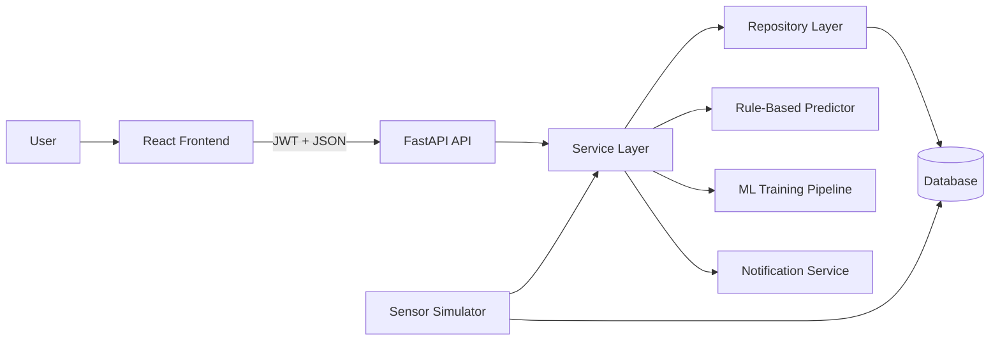
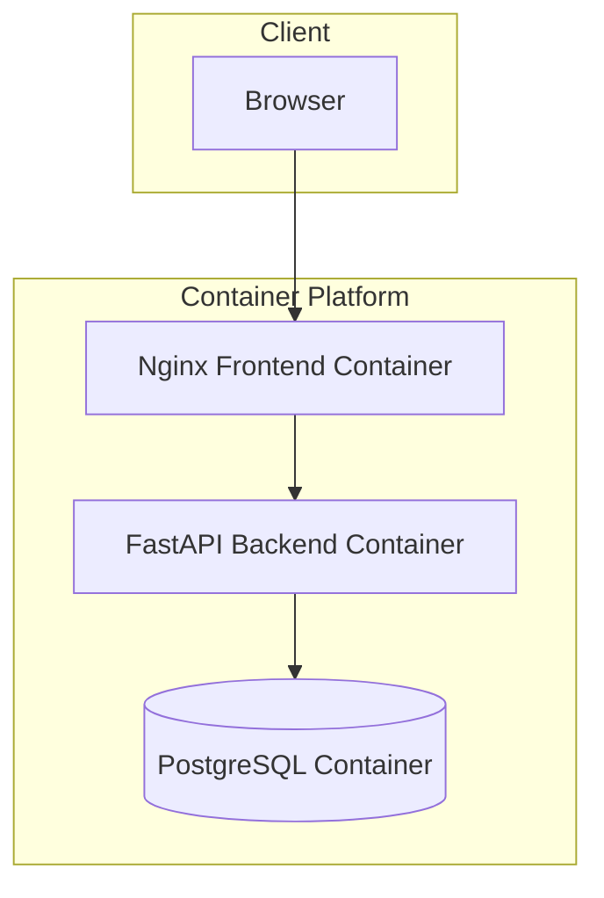
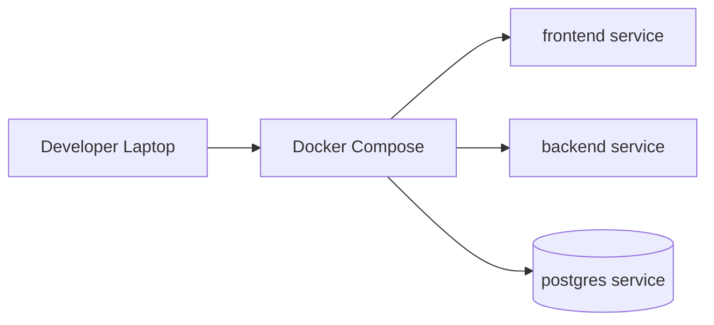
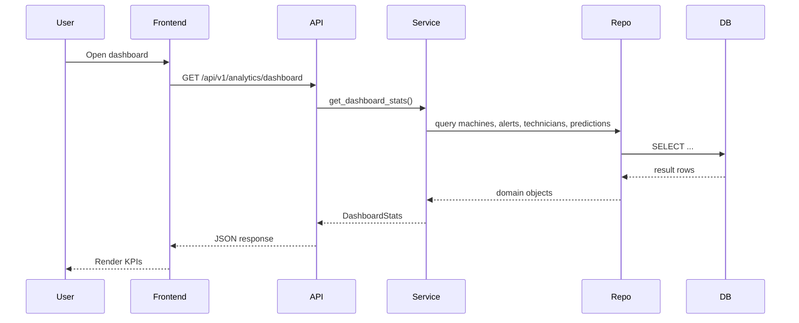
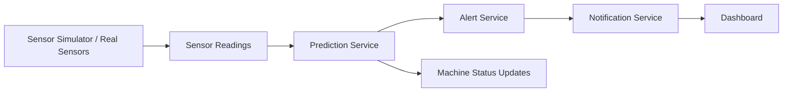
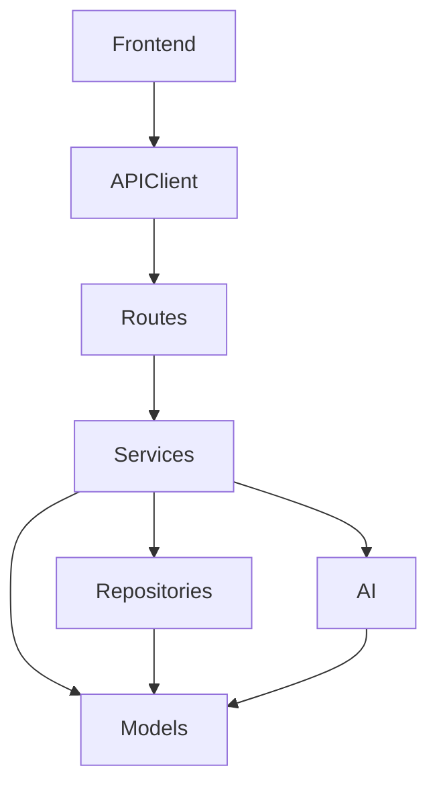
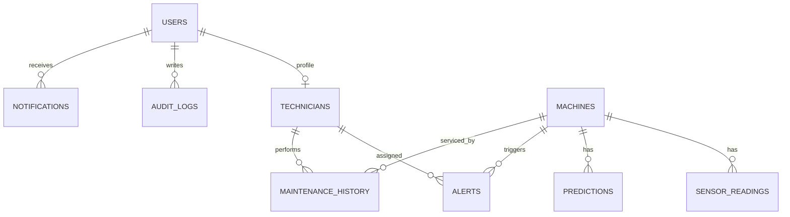
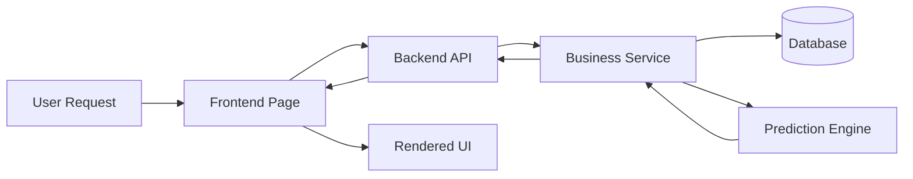

# Ranbridge Industrial Maintenance System

## Enterprise Architecture and Technical Documentation

**Document Version:** 1.0
**Status:** Draft
**Audience:** Software Development Teams, Technical Architects, DevOps Engineers, QA Engineers, Security Auditors, Clients, Investors, University Evaluators, Open Source Contributors
**Scope:** Source code, configuration, APIs, database schema, Docker deployment, frontend, backend, AI/ML modules, and operational workflows

---

## 1. Executive Summary

### Project Overview
Ranbridge is a smart industrial maintenance platform designed to monitor machines, analyze sensor data, predict failure risk, create alerts, coordinate technicians, and present operational insights through a web dashboard. The solution combines a FastAPI backend, a React/Vite frontend, a PostgreSQL-ready data layer, a rule-based predictive engine, and an extensible machine learning pipeline.

The application is organized as a single deployable product with clearly separated backend and frontend layers. The backend exposes authenticated APIs under `/api/v1`, persists operational data with SQLAlchemy and Alembic, and simulates industrial sensor data when physical devices are unavailable. The frontend provides role-based access to dashboards, machine records, alerts, predictions, and maintenance workflows.

### Business Problem
Industrial operations often suffer from unplanned downtime, delayed maintenance, fragmented visibility into asset health, and inefficient technician dispatch. In many plants, sensor telemetry exists but is not converted into timely action. Manual inspection is slow, expensive, and reactive.

### Proposed Solution
Ranbridge addresses this by continuously collecting or simulating sensor readings, scoring machine health, generating predictive maintenance output, creating alerts for abnormal conditions, and surfacing actionable dashboards for operations teams. It also assigns technicians and notifies stakeholders based on role and severity.

### Objectives
- Reduce unplanned downtime through early anomaly detection.
- Improve maintenance planning using predictive and rule-based analysis.
- Centralize machine, technician, alert, and maintenance records.
- Provide enterprise-friendly dashboards and reports.
- Support secure, role-aware access for operators, managers, and administrators.

### Key Features
- JWT-based authentication and role-based authorization.
- Machine lifecycle management.
- Sensor reading ingestion and dashboard trend visualization.
- Rule-based predictive maintenance engine with ML training pipeline.
- Alert generation, acknowledgment, and resolution workflows.
- Technician assignment and maintenance history tracking.
- Notification delivery by user and role.
- Analytics reports and operational summaries.
- Dockerized deployment with backend, frontend, and database services.

### Business Benefits
- Lower downtime and maintenance cost.
- Faster incident response and better technician utilization.
- Improved operational awareness for factory leadership.
- Better auditability through structured persistence and audit logs.
- A foundation for future AI/ML maturity.

### Expected Outcomes
- Timely identification of abnormal machine behavior.
- More consistent maintenance planning.
- Better visibility into machine health and operational risk.
- Improved accountability through alerts, notifications, and logs.

### Target Users
- Factory operators
- Maintenance technicians
- Factory managers
- Administrators
- QA and DevOps teams
- Technical evaluators and investors

---

## 2. Project Vision

### Mission
To help industrial organizations detect equipment degradation early, act on machine health data quickly, and reduce downtime through intelligent maintenance workflows.

### Vision
To evolve into a production-grade predictive maintenance platform that can ingest real-world IoT telemetry, apply hybrid rule-based and ML-driven intelligence, and scale across multiple factories and asset classes.

### Goals
- Provide reliable machine health scoring.
- Enable actionable maintenance planning.
- Standardize operational data handling.
- Support secure multi-role access.
- Create a path from MVP simulation to real industrial integration.

### Success Metrics
- Reduced mean time to detect anomalies.
- Reduced mean time to repair.
- Lower percentage of critical machines remaining unresolved.
- Increased technician assignment efficiency.
- Improved predicted-failure to prevented-downtime ratio.

### KPIs
- Active alert count
- Average machine health score
- Predicted failures per time window
- Downtime prevented hours
- Maintenance cost saved
- Available technician count
- Alert resolution time
- Notification read rate

### Future Roadmap
- Replace simulator input with MQTT/PLC/SCADA ingestion.
- Promote ML models from experimental to primary inference path.
- Add real-time streaming and websocket updates.
- Introduce tenant isolation for multi-factory deployment.
- Add RBAC policy management and fine-grained permissions.
- Add audit dashboards and compliance reporting.

---

## 3. System Architecture

### Overall Architecture
Ranbridge follows a modular monolithic architecture with a layered backend and a SPA frontend.

- Presentation layer: React frontend
- API layer: FastAPI routes
- Business layer: services and AI engines
- Persistence layer: repositories and SQLAlchemy models
- Infrastructure layer: Docker, Nginx, PostgreSQL, Alembic

### Architecture Style
- Layered architecture
- Repository pattern
- Service-oriented business logic
- SPA client-server model
- Hybrid rule-based and ML-ready decisioning

### Client-Server Flow
1. User authenticates through the frontend.
2. Frontend stores JWT in local storage.
3. Axios attaches `Authorization: Bearer <token>`.
4. FastAPI validates token and role.
5. Repositories fetch or mutate data.
6. Services compute outcomes.
7. API returns JSON to frontend.
8. Frontend renders dashboards and lists.

### Microservices
Not currently implemented. The system is a modular monolith with clear seams that could later be split into dedicated services for auth, telemetry, analytics, notifications, and ML inference.

### Layered Architecture
- Controller layer: route modules in [backend/app/api/routes](../backend/app/api/routes)
- Service layer: business logic in [backend/app/services](../backend/app/services)
- Repository layer: data access in [backend/app/repositories](../backend/app/repositories)
- Domain model layer: ORM entities in [backend/app/models](../backend/app/models)
- Infrastructure layer: [backend/app/database](../backend/app/database), [backend/app/core](../backend/app/core), Docker files, Alembic

### Component Diagram

### Deployment Architecture

### Infrastructure Diagram

### Request Lifecycle
1. Browser issues HTTP request.
2. React route/page invokes Axios.
3. Backend receives request at `/api/v1/...`.
4. Dependency injection resolves DB session and current user.
5. Route validates inputs and permissions.
6. Service and repository compute the response.
7. ORM object is serialized through Pydantic schema.
8. Frontend updates the UI state.

### Response Lifecycle
1. API returns typed JSON or text response.
2. Axios resolves or raises HTTP error.
3. Interceptors handle `401` by clearing auth state.
4. React Query or component state updates the page.

### Sequence Diagram

### Data Flow Diagram

### Interaction Flow
- Authentication creates session token.
- Machine telemetry triggers predictions.
- Alerts derive from sensor thresholds and predicted failure probability.
- Notifications fan out to relevant users.
- Dashboard aggregates trends and operational summaries.

### Dependency Graph

---

## 4. Technology Stack

### Frontend
- React 19: component-driven UI and SPA routing.
- React Router DOM 7: route management and protected navigation.
- TanStack React Query 5: server-state handling and request caching.
- Axios: HTTP client with interceptors.
- Recharts: charts for trends and dashboards.
- Lucide React: iconography.
- Vite 8: build and dev server.
- TypeScript 6: stronger type safety.
- Tailwind CSS 4: utility-first styling and fast UI composition.
- Oxlint: lightweight linting.

Why selected: the stack is optimized for fast iteration, typed client integration, and dashboard-heavy UI rendering.

### Backend
- FastAPI: async-capable API framework with OpenAPI generation.
- Uvicorn: ASGI server.
- SQLAlchemy 2: ORM and query abstraction.
- Alembic: schema migrations.
- Pydantic v2 and pydantic-settings: schema validation and configuration.
- python-jose: JWT creation and validation.
- Passlib + bcrypt: password hashing.
- slowapi: rate limiting.
- python-multipart: form handling for OAuth2 login.

Why selected: FastAPI gives strong API ergonomics, typed validation, and automatic documentation; SQLAlchemy and Alembic provide a mature persistence stack.

### Database
- SQLite in local development.
- PostgreSQL in Docker Compose.

Why selected: SQLite enables low-friction local development; PostgreSQL is the intended production database.

### AI/ML
- NumPy: numerical operations.
- Pandas: tabular data handling.
- scikit-learn: model training and evaluation.
- joblib: model persistence.

Why selected: they provide a practical path from heuristic logic to trainable models.

### Cloud
- No cloud provider is hard-coded.
- The Docker-based architecture can be deployed to AWS, Azure, GCP, or an on-prem Kubernetes platform.

### Authentication
- OAuth2 password flow at the API level.
- JWT bearer tokens.
- Password hashing with bcrypt.

### State Management
- React Context for auth state.
- TanStack React Query for server state.
- Local storage for token persistence.

### Caching
- React Query cache with short stale time.
- No backend distributed cache is implemented.

### Containerization
- Docker for backend and frontend.
- Docker Compose for local orchestration.
- Nginx for frontend static serving and reverse proxying.

### DevOps
- Docker Compose orchestration.
- Alembic migrations.
- Vite/TypeScript build pipeline.
- npm and pip dependency management.

### Monitoring
- `/health` endpoint.
- Application startup logs and rate limiting.
- Audit log table for user actions.

### Logging
- Minimal console logging in simulator error handling.
- Structured audit log records for security-relevant actions.

### Testing
- No committed automated tests were found in the workspace snapshot.

### Package Managers
- `pip` for backend dependencies.
- `npm` for frontend dependencies.

### Build Tools
- Vite
- TypeScript compiler
- Alembic
- Docker
- Nginx

### Library Rationale Summary
| Area | Library | Reason |
|---|---|---|
| API | FastAPI | Validation, OpenAPI, dependency injection |
| ORM | SQLAlchemy | Mature data access layer |
| Migrations | Alembic | Controlled schema evolution |
| Auth | python-jose, Passlib | JWT and secure password hashing |
| Rate limiting | slowapi | Request throttling |
| ML | scikit-learn | Baseline ML training path |
| Charts | Recharts | Dashboard visualizations |
| Data fetching | React Query | Caching and request coordination |
| HTTP | Axios | Request/response interceptors |

---

## 5. Folder Structure

### Top-Level Structure
- `backend/`: FastAPI application, database models, services, AI logic, migrations, and simulator.
- `frontend/`: React application and web assets.
- `docker-compose.yml`: local multi-container orchestration.
- `alert_system/`: present in the workspace listing but not expanded in the current snapshot.

### Backend Folders
#### `backend/app/`
Primary backend package.

#### `backend/app/api/`
API dependencies and route modules.
- Responsibility: expose HTTP endpoints and wire them to services.
- Pattern: controller layer.

#### `backend/app/api/routes/`
Endpoint groups for auth, users, machines, sensor readings, predictions, alerts, technicians, maintenance, analytics, notifications, and AI.
- Example usage: `GET /api/v1/analytics/dashboard`.

#### `backend/app/ai/`
Predictive maintenance logic.
- `rule_based.py`: current production predictor.
- `ml_pipeline.py`: future ML training pipeline.
- `models/`: persisted model artifacts.

#### `backend/app/core/`
- `config.py`: environment-driven settings.
- `security.py`: hashing and JWT utilities.

#### `backend/app/database/`
Engine, session, and declarative base wiring.

#### `backend/app/models/`
SQLAlchemy ORM entities.

#### `backend/app/repositories/`
Database access helpers and query abstractions.

#### `backend/app/schemas/`
Pydantic contracts shared by routes and frontend expectations.

#### `backend/app/services/`
Business logic and orchestration.

#### `backend/app/simulator/`
Synthetic telemetry generator.

#### `backend/app/utils/`
Seed data and supporting utilities.

#### `backend/alembic/`
Migration environment and versioned schema changes.

### Frontend Folders
#### `frontend/src/`
Main React source tree.

#### `frontend/src/components/`
Reusable UI primitives and layout shell.

#### `frontend/src/contexts/`
React context providers, primarily authentication.

#### `frontend/src/pages/`
Page-level route components.

#### `frontend/src/services/`
API client wrappers.

#### `frontend/src/types/`
Shared TypeScript data contracts.

#### `frontend/src/utils/`
Client-side helper functions.

### Design Pattern Summary
- Presentation/model separation through frontend pages and components.
- Repository pattern in data access.
- Service pattern in business logic.
- Dependency injection through FastAPI dependencies.
- Singleton-like simulator instance in memory.
- Factory-like predictor selection through `get_predictor()`.

### Best Practices
- Keep route handlers thin.
- Keep validation in schemas.
- Keep persistence in repositories.
- Keep policy and orchestration in services.
- Keep simulation and ML concerns isolated.

---

## 6. Backend Documentation

### Application Startup
The application entry point is [backend/app/main.py](../backend/app/main.py). Startup behavior:
- Loads settings from environment.
- Creates the database schema via `Base.metadata.create_all`.
- Seeds demo data via `seed_sample_data`.
- Starts the background sensor simulator.
- Registers CORS and rate limiting.
- Exposes `/health` and the full API router.

### Routing
All routes are mounted under `/api/v1` in [backend/app/api/routes/__init__.py](../backend/app/api/routes/__init__.py).

### Controllers
Route modules act as controllers and keep orchestration near HTTP concerns. Key controllers include:
- [auth.py](../backend/app/api/routes/auth.py)
- [users.py](../backend/app/api/routes/users.py)
- [machines.py](../backend/app/api/routes/machines.py)
- [sensor_readings.py](../backend/app/api/routes/sensor_readings.py)
- [predictions.py](../backend/app/api/routes/predictions.py)
- [alerts.py](../backend/app/api/routes/alerts.py)
- [technicians.py](../backend/app/api/routes/technicians.py)
- [maintenance.py](../backend/app/api/routes/maintenance.py)
- [analytics.py](../backend/app/api/routes/analytics.py)
- [notifications.py](../backend/app/api/routes/notifications.py)
- [ai.py](../backend/app/api/routes/ai.py)

### Services
- AuthService: registration, login, user update, password hashing.
- AnalyticsService: dashboard statistics, trends, summaries.
- AlertService: threshold and failure-probability alert creation, technician auto-assignment, manager notifications.
- PredictionService: reading-to-prediction orchestration, machine health updates, prediction notifications.
- NotificationService: fan-out notification creation by user or role.
- HealthScoreEngine: heuristic health scoring.
- RecommendationEngine: maintenance plan generation.

### Repositories
The repository layer isolates CRUD and query logic. The shared base is [backend/app/repositories/base.py](../backend/app/repositories/base.py).

### Models
The ORM entities are:
- User
- Machine
- Technician
- SensorReading
- Prediction
- Alert
- Notification
- MaintenanceHistory
- AuditLog

### Schemas
Schemas in [backend/app/schemas/__init__.py](../backend/app/schemas/__init__.py) define request and response contracts, enum values, pagination wrappers, dashboard summaries, and technician assistance payloads.

### DTOs
Pydantic models function as DTOs. Examples:
- `UserCreate`, `UserUpdate`, `UserResponse`
- `MachineCreate`, `MachineUpdate`, `MachineResponse`
- `AlertUpdate`, `AlertResponse`
- `PredictionResponse`
- `DashboardStats`, `AnalyticsSummary`

### Middleware
- CORS middleware is enabled in [backend/app/main.py](../backend/app/main.py).
- Rate limiting is applied through slowapi.

### Authentication
- OAuth2 password form at `/api/v1/auth/login`
- JWT bearer tokens in `Authorization`
- User extraction through `get_current_user`
- Role-based guards via `RequireAdmin` and `RequireManager`

### Authorization
Authorization is enforced by dependency injection in [backend/app/api/deps.py](../backend/app/api/deps.py):
- `CurrentUser` for any authenticated user.
- `RequireAdmin` for administrator-only operations.
- `RequireManager` for admin and factory manager operations.

### Business Logic
The main business rules are:
- Machines must have unique `machine_id` values.
- Alert status changes are normalized through the alert service.
- Predictions update machine health and status.
- Notifications are created for active users or specified roles.
- Severe alerts may auto-assign technicians.

### Validation
Validation is enforced at the schema layer through Pydantic field constraints and enum types.

### Error Handling
- 404 for missing entities.
- 400 for duplicate machine IDs and registration collisions.
- 401 for invalid credentials or tokens.
- 403 for unauthorized access.

### Logging
- Audit logs are stored in the `audit_logs` table.
- Login, machine lifecycle actions, and other security-sensitive operations are recorded.

### Configuration
Settings are centralized in [backend/app/core/config.py](../backend/app/core/config.py) and loaded from `.env`.

### Dependency Injection
FastAPI dependencies supply:
- Database sessions
- Authenticated current user
- Role-restricted user variants

### Utilities
- `seed_sample_data` inserts demo users, technicians, machines, and maintenance history.
- The sensor simulator generates synthetic telemetry and invokes service logic.

### Background Jobs
The simulator acts as a lightweight background job loop. It periodically:
- loads active machines
- generates a reading
- persists telemetry
- calls prediction processing
- evaluates alerts

### Scheduler
No external scheduler such as Celery or APScheduler is implemented. The background thread in the simulator is the only scheduled runtime loop.

---

## 7. Frontend Documentation

### Application Structure
The frontend is a React SPA bootstrapped in [frontend/src/main.tsx](../frontend/src/main.tsx) and routed in [frontend/src/App.tsx](../frontend/src/App.tsx).

### Pages
- `LoginPage`: authentication entry point.
- `DashboardPage`: operational overview.
- `MachinesPage` and `MachineDetailPage`: asset inventory and details.
- `LiveMonitoringPage`: near-real-time telemetry view.
- `AlertsPage`: alert triage.
- `PredictionsPage`: failure predictions.
- `MaintenancePage`: maintenance records.
- `TechniciansPage`: technician management.
- `AnalyticsPage`: KPI summaries and reports.
- `FactoryTwinPage`: digital twin or synthetic plant overview.
- `ProfilePage`: current user information.
- `SettingsPage`: application settings.
- `NotFoundPage`: route fallback.

### Layouts
Shared shell components live in [frontend/src/components/Layout.tsx](../frontend/src/components/Layout.tsx), [Sidebar.tsx](../frontend/src/components/Sidebar.tsx), and [Header.tsx](../frontend/src/components/Header.tsx).

### Components
- `DataTable`, `Pagination`, `PaginationControls`
- `StatCard`, `StatusBadge`, `HealthGauge`, `TrendChart`
- `ProtectedRoute`

These components support dashboard presentation, data browsing, and auth-gated navigation.

### Hooks
No custom hook folder was present in the current snapshot. Auth state is managed through React Context instead.

### Services
[frontend/src/services/api.ts](../frontend/src/services/api.ts) is the typed Axios client layer.

### API Integration
- Requests go to `/api/v1`.
- JWT is read from local storage.
- `401` responses clear stored auth data and redirect to `/login`.

### State Management
- Auth state: React Context.
- Server state: TanStack React Query.
- Client persistence: local storage.

### Routing
Protected routes wrap all authenticated views. `/` redirects to `/dashboard` and unknown routes land on `NotFoundPage`.

### Authentication Flow
1. User submits credentials on login page.
2. Frontend calls `POST /api/v1/auth/login`.
3. Token is stored in local storage.
4. Frontend fetches `/auth/me`.
5. App context hydrates user state.
6. Protected routes become accessible.

### Protected Routes
Protected navigation is enforced by [frontend/src/components/ProtectedRoute.tsx](../frontend/src/components/ProtectedRoute.tsx) and the auth context.

### Forms
Forms are handled directly in page components. The current codebase does not show a dedicated form library.

### Validation
Client-side validation is primarily implicit through controlled form logic and backend schema validation.

### Styling
The project uses Tailwind CSS 4 and component-level CSS files such as [frontend/src/App.css](../frontend/src/App.css) and [frontend/src/index.css](../frontend/src/index.css).

### Responsive Design
Vite, React, and Tailwind provide a mobile-friendly base. Layout components and utility classes should be used to preserve responsive behavior.

### Theme
The current frontend theme is dashboard-oriented and operational rather than brand-heavy. It is suitable for industrial monitoring interfaces.

---

## 8. Database Documentation

### ER Diagram

### Database Design
The schema is normalized around core operational entities:
- Users and technicians are distinct, with optional user-linked technician profiles.
- Machines are the central asset entity.
- Sensor readings, predictions, alerts, and maintenance history all reference machines.
- Notifications reference users.
- Audit logs record user actions.

### Table Documentation
#### `users`
Purpose: authenticated identities and role assignments.

#### `machines`
Purpose: asset inventory and health status.

#### `technicians`
Purpose: workforce records and assignment readiness.

#### `sensor_readings`
Purpose: telemetry samples for machine condition monitoring.

#### `predictions`
Purpose: failure forecasts, health scoring, and recommendation metadata.

#### `alerts`
Purpose: threshold breaches and high-risk machine events.

#### `notifications`
Purpose: user-facing notifications derived from system activity.

#### `maintenance_history`
Purpose: completed or recorded maintenance work.

#### `audit_logs`
Purpose: traceability of security- and workflow-relevant actions.

### Relationships
- `users.id` to `technicians.user_id` with `SET NULL`.
- `users.id` to `notifications.user_id` with `CASCADE`.
- `users.id` to `audit_logs.user_id` with `SET NULL`.
- `machines.id` to `sensor_readings.machine_id` with `CASCADE`.
- `machines.id` to `predictions.machine_id` with `CASCADE`.
- `machines.id` to `alerts.machine_id` with `CASCADE`.
- `machines.id` to `maintenance_history.machine_id` with `CASCADE`.
- `technicians.id` to `alerts.technician_id` with `SET NULL`.
- `technicians.id` to `maintenance_history.technician_id` with `SET NULL`.

### Indexes
Common indexes exist on primary keys, foreign keys, unique identity columns, and timestamp fields.

### Constraints
- Unique email and username in `users`.
- Unique `machine_id` in `machines`.
- Enum-backed status and severity columns.
- Non-null constraints on core operational fields.

### Normalization
The schema is broadly in third normal form for the current scope, although some denormalized summary fields exist in `machines` and `predictions` for fast dashboard rendering.

### Data Dictionary
| Table | Key Fields | Notes |
|---|---|---|
| users | id, email, username, role | Login and authorization |
| machines | id, machine_id, status, health_score | Asset inventory |
| technicians | id, user_id, availability | Workforce management |
| sensor_readings | machine_id, temperature, vibration, current | Telemetry |
| predictions | failure_type, probability, RUL | Predictive output |
| alerts | severity, status, technician_id | Operational incidents |
| notifications | user_id, type, status | User communication |
| maintenance_history | machine_id, repair_date | Service records |
| audit_logs | user_id, action, resource | Compliance trace |

### Migration Strategy
- Alembic versioning is used.
- Initial migration is [backend/alembic/versions/001_initial_schema.py](../backend/alembic/versions/001_initial_schema.py).
- Future changes should follow incremental revision files.

### Backup Strategy
No automated backup workflow is committed in the workspace. Recommended baseline:
- Daily full database backups.
- Point-in-time recovery for PostgreSQL.
- Encrypted offsite backup storage.
- Restore drills on a scheduled basis.

---

## 9. API Documentation

### API Overview
Base path: `/api/v1`

### Authentication API
#### `POST /auth/register`
Purpose: create a new user account.
Auth: none.
Headers: `Content-Type: application/json`
Body: `UserCreate`.
Response: `UserResponse`.
Status codes: `201`, `400`.

#### `POST /auth/login`
Purpose: obtain a JWT access token.
Auth: none.
Headers: `Content-Type: application/x-www-form-urlencoded`
Body: username/password form fields.
Response: `Token`.
Status codes: `200`, `401`.

#### `GET /auth/me`
Purpose: return the current authenticated user.
Auth: bearer token.
Response: `UserResponse`.
Status codes: `200`, `401`.

### Machine API
#### `GET /machines`
Purpose: list machines with pagination and filters.
Query: `page`, `page_size`, `search`, `status`, `factory`.
Auth: bearer token.
Response: `PaginatedResponse[MachineResponse]`.

#### `GET /machines/{machine_id}`
Purpose: fetch a machine by database ID.
Auth: bearer token.
Response: `MachineResponse`.

#### `POST /machines`
Purpose: create a machine.
Auth: admin or factory manager.
Response: `MachineResponse`.

#### `PUT /machines/{machine_id}`
Purpose: update a machine.
Auth: admin or factory manager.
Response: `MachineResponse`.

#### `DELETE /machines/{machine_id}`
Purpose: delete a machine.
Auth: admin or factory manager.
Response: no content.

### Sensor Reading API
#### `GET /sensor-readings`
Purpose: list readings with optional machine filter.
Auth: bearer token.
Response: `PaginatedResponse[SensorReadingResponse]`.

#### `GET /sensor-readings/latest/{machine_id}`
Purpose: retrieve recent readings for one machine.
Auth: bearer token.
Response: `list[SensorReadingResponse]`.

### Prediction API
#### `GET /predictions`
Purpose: list predictions or recent trends for one machine.
Auth: bearer token.
Response: `PaginatedResponse[PredictionResponse]`.

#### `GET /predictions/latest/{machine_id}`
Purpose: retrieve latest prediction for a machine.
Auth: bearer token.
Response: `PredictionResponse`.

### Alert API
#### `GET /alerts`
Purpose: list alerts with filters.
Auth: bearer token.
Response: `PaginatedResponse[AlertResponse]`.

#### `GET /alerts/{alert_id}`
Purpose: retrieve a specific alert.
Auth: bearer token.
Response: `AlertResponse`.

#### `PUT /alerts/{alert_id}`
Purpose: update status, technician assignment, or action.
Auth: bearer token.
Response: `AlertResponse`.

#### `GET /alerts/{alert_id}/assistance`
Purpose: assemble technician assistance context.
Auth: bearer token.
Response: `TechnicianAssistanceResponse`.

### Technician API
#### `GET /technicians`
Purpose: list technicians with search and availability filters.
Auth: bearer token.
Response: `PaginatedResponse[TechnicianResponse]`.

#### `POST /technicians`
Purpose: create a technician.
Auth: admin or factory manager.
Response: `TechnicianResponse`.

#### `PUT /technicians/{technician_id}`
Purpose: update a technician.
Auth: admin or factory manager.
Response: `TechnicianResponse`.

#### `DELETE /technicians/{technician_id}`
Purpose: delete a technician.
Auth: admin or factory manager.
Response: no content.

### Maintenance API
#### `GET /maintenance`
Purpose: list maintenance records.
Auth: bearer token.
Response: `PaginatedResponse[MaintenanceResponse]`.

#### `GET /maintenance/{record_id}`
Purpose: fetch a maintenance record.
Auth: bearer token.
Response: `MaintenanceResponse`.

#### `POST /maintenance`
Purpose: create a maintenance record.
Auth: bearer token.
Response: `MaintenanceResponse`.

#### `PUT /maintenance/{record_id}`
Purpose: update a maintenance record.
Auth: bearer token.
Response: `MaintenanceResponse`.

### Analytics API
#### `GET /analytics/dashboard`
Purpose: operational KPI snapshot.
Auth: bearer token.
Response: `DashboardStats`.

#### `GET /analytics/trends/{machine_id}`
Purpose: time-series trends for a machine.
Auth: bearer token.
Response: `MachineTrends`.

#### `GET /analytics/summary`
Purpose: high-level analytical summary.
Auth: bearer token.
Response: `AnalyticsSummary`.

#### `GET /analytics/dashboard/readings`
Purpose: recent dashboard readings.
Auth: bearer token.
Response: `list[SensorReadingResponse]`.

#### `GET /analytics/dashboard/alerts`
Purpose: recent dashboard alerts.
Auth: bearer token.
Response: `list[AlertResponse]`.

#### `GET /analytics/dashboard/maintenance`
Purpose: recent dashboard maintenance entries.
Auth: bearer token.
Response: `list[MaintenanceResponse]`.

#### `GET /analytics/reports/{report_type}`
Purpose: text summary report.
Auth: bearer token.
Response: plain text.

### Notifications API
#### `GET /notifications`
Purpose: list current user notifications.
Auth: bearer token.
Response: `PaginatedResponse[NotificationResponse]`.

#### `PUT /notifications/{notification_id}/read`
Purpose: mark notification as read.
Auth: bearer token.
Response: `NotificationResponse`.

#### `PUT /notifications/{notification_id}/archive`
Purpose: archive notification.
Auth: bearer token.
Response: `NotificationResponse`.

#### `PUT /notifications/read-all`
Purpose: mark all current user notifications as read.
Auth: bearer token.
Response: `MessageResponse`.

### AI API
#### `POST /ai/train`
Purpose: train an ML model.
Auth: admin only.
Response: training summary.

#### `GET /ai/models`
Purpose: list available model options.
Auth: bearer token.
Response: model metadata.

### API Design Notes
- APIs are versioned.
- Responses are strongly typed through Pydantic schemas.
- Most collections use pagination.
- Auth-sensitive operations are protected through dependencies.

---

## 10. Authentication & Security

### JWT
JWT tokens are issued in [backend/app/core/security.py](../backend/app/core/security.py) using the configured secret key and algorithm. The token carries the user ID and role.

### OAuth
The login endpoint uses the OAuth2 password flow via FastAPI security primitives.

### Role-Based Access Control
Roles include `admin`, `factory_manager`, and `technician`. Dependency guards restrict higher-risk operations.

### Permissions
- Admins can manage users and train models.
- Admins and factory managers can manage machines and technicians.
- Authenticated users can view their data and access dashboard reads.

### Password Hashing
Passwords are hashed with bcrypt through Passlib.

### Encryption
- Password hashes are one-way.
- JWT signing is symmetric with HS256 in the current implementation.
- Database-at-rest encryption is not implemented in code and should be handled by the deployment platform.

### HTTPS
HTTPS termination is expected at the reverse proxy, load balancer, or ingress layer in production.

### Secrets Management
The current code reads secrets from environment variables. Production deployments should source them from a secrets manager or orchestrator secret store.

### Environment Variables
Security-sensitive variables include:
- `SECRET_KEY`
- `DATABASE_URL`
- `CORS_ORIGINS`
- `RATE_LIMIT`
- `SIMULATOR_ENABLED`

### CORS
CORS is explicitly configured from `CORS_ORIGINS`.

### CSRF
The backend uses bearer tokens, so CSRF risk is reduced compared with cookie-based auth. If cookies are introduced later, CSRF controls will be required.

### XSS
The frontend should continue to avoid unsafe HTML injection and should rely on React escaping and safe rendering practices.

### SQL Injection Protection
SQLAlchemy ORM and parameterized queries provide strong baseline protection.

### Rate Limiting
slowapi applies request throttling and a `/health` endpoint limit.

### Audit Logs
Audit logs are created for security-relevant actions such as login and machine lifecycle events.

### OWASP Compliance
The project aligns with several OWASP practices already:
- hashed passwords
- token-based auth
- input validation
- role checks
- rate limiting
- audit logs

### Security Gaps / Improvement Opportunities
- `SECRET_KEY` defaults are weak and must not reach production.
- No refresh token flow is present.
- No MFA support is present.
- No CSRF protection is needed today, but would be required if cookies replace bearer tokens.
- No centralized secrets manager integration is implemented.
- Some admin routes expose broad operational power and should eventually support finer-grained permissions.

---

## 11. AI / Machine Learning

### Problem Statement
Predict machine failure risk early enough to allow planned maintenance instead of reactive repair.

### Dataset
The current ML pipeline generates synthetic labeled telemetry using normal distributions and threshold-based failure labels.

### Data Cleaning
The synthetic generator produces structured numerical inputs. In production, cleaning should include:
- outlier removal
- missing-value handling
- unit normalization
- sensor drift correction
- anomaly labeling validation

### Feature Engineering
Feature columns in [backend/app/ai/ml_pipeline.py](../backend/app/ai/ml_pipeline.py):
- temperature
- vibration
- current
- humidity
- pressure
- rpm

### Training Pipeline
The pipeline:
1. Generates or accepts a dataset.
2. Splits into train/test sets.
3. Standardizes features with `StandardScaler`.
4. Fits one of three classifiers.
5. Evaluates accuracy and classification report.
6. Persists the model and scaler with `joblib`.

### Models
- Random Forest Classifier
- Gradient Boosting Classifier
- Logistic Regression

### Evaluation Metrics
- Accuracy
- Classification report metrics such as precision, recall, and F1 score

### Inference
Current production inference uses the rule-based predictor via [backend/app/ai/rule_based.py](../backend/app/ai/rule_based.py). The ML pipeline is staged for future adoption.

### Deployment
Model artifacts are saved to [backend/app/ai/models](../backend/app/ai/models).

### Retraining Strategy
Recommended:
- retrain on new labeled sensor and maintenance data
- version each model artifact
- compare ML output against rule-based baseline
- gate promotion through validation metrics

### Model Versioning
Model files are named by algorithm, such as `random_forest_model.joblib`.

### Monitoring
Recommended:
- prediction drift
- concept drift
- calibration drift
- false positive and false negative trends

### Mathematical Explanation
#### 1. Standardization
For each feature value $x$:
$$z = \frac{x - \mu}{\sigma}$$
where $\mu$ is the feature mean and $\sigma$ is the standard deviation.

#### 2. Logistic Regression
The probability of failure is modeled as:
$$P(y=1 \mid x) = \sigma(w^T x + b) = \frac{1}{1 + e^{-(w^T x + b)}}$$
The loss optimized is typically binary cross-entropy:
$$L = -\frac{1}{n} \sum_{i=1}^{n} \left[y_i \log(p_i) + (1-y_i)\log(1-p_i)\right]$$

#### 3. Random Forest
A random forest is an ensemble of decision trees. Each tree is trained on a bootstrap sample and a random subset of features. Final classification is determined by majority vote:
$$\hat{y} = \text{mode}(T_1(x), T_2(x), \dots, T_k(x))$$

#### 4. Gradient Boosting
Gradient boosting builds trees sequentially. At step $m$, the model updates as:
$$F_m(x) = F_{m-1}(x) + \eta \cdot h_m(x)$$
where $\eta$ is the learning rate and $h_m$ is the new tree fitted to the residual signal.

#### 5. Rule-Based Failure Probability
The current production predictor is threshold driven rather than probabilistic in the statistical sense. It assigns heuristic probabilities based on sensor conditions and anomaly labels.

### Observations
- The ML pipeline is appropriate as a future extension path.
- The rule-based engine is the production control path today.
- Synthetic labels are useful for prototyping but should not be treated as production-grade training truth.

---

## 12. DevOps Documentation

### Docker
- Backend image: Python 3.12 slim with system packages for PostgreSQL client compilation.
- Frontend image: Node build stage plus Nginx runtime stage.

### Docker Compose
[docker-compose.yml](../docker-compose.yml) defines:
- PostgreSQL database service
- FastAPI backend service
- Nginx-served frontend service

### CI/CD
No CI/CD pipeline files were present in the snapshot. Recommended baseline:
- lint backend and frontend
- run tests
- build Docker images
- apply migrations
- deploy to staging
- require approval for production

### GitHub Actions
Not currently implemented in the workspace.

### Build Pipeline
- Backend: install Python packages, run Alembic migrations, start Uvicorn.
- Frontend: install dependencies, run TypeScript compile, build Vite bundle.

### Release Pipeline
Recommended release order:
1. Build artifacts
2. Run smoke tests
3. Deploy database migration
4. Deploy backend
5. Deploy frontend
6. Validate health checks and critical flows

### Environment Management
- Development uses `.env` and Docker Compose.
- Production should override secrets and database URLs through secure platform configuration.

### Versioning
- API version prefix: `/api/v1`
- Alembic schema versions
- Docker image tags should be immutable and traceable

### Deployment Strategy
The current deployment model is container-based and compatible with:
- Docker hosts
- VM-based deployments
- Kubernetes
- Managed container services

### Rollback
Recommended rollback strategy:
- keep previous image tags
- keep prior Alembic revision path documented
- use backward-compatible migrations whenever possible
- validate health endpoint before traffic cutover

### Infrastructure
Core infrastructure components:
- web frontend
- API backend
- relational database
- background telemetry simulator
- logging and monitoring layer

---

## 13. Performance Optimization

### Caching
- React Query caches server data briefly.
- No backend cache is implemented.

### Lazy Loading
Not explicitly implemented. Could be added for large frontend pages or charts.

### Pagination
Pagination is implemented across major list endpoints.

### Compression
Nginx can compress responses in production if configured.

### Database Optimization
- Indexed foreign keys and timestamps.
- Unique identifiers on business keys.
- Repository queries keep access patterns localized.

### Query Optimization
Current dashboard endpoints aggregate several counts and recent rows. For large deployments, these should be reviewed for:
- precomputed summary tables
- materialized views
- query profiling

### Asynchronous Processing
The simulator runs in a background thread, but broader async jobs are not implemented.

### Threading
The sensor simulator uses a daemon thread. This is suitable for development and MVP usage, but not as a long-term job system.

### Connection Pooling
SQLAlchemy engine is configured with `pool_pre_ping=True`.

### Benchmark Results
No benchmark results were committed in the workspace.

### Bottlenecks and Recommendations
- Dashboard summary queries may become expensive with large telemetry volumes.
- Recompute-heavy analytics should be cached or pre-aggregated.
- The simulator is not production-grade as a real ingestion mechanism.
- ML inference should eventually be isolated from request/response latency if model complexity grows.

---

## 14. Monitoring & Logging

### Logging Strategy
Current logging is minimal. The main structured traceability is the audit log table.

### Monitoring
- `/health` endpoint
- dashboard KPI endpoints
- simulator startup and runtime behavior

### Health Checks
`GET /health` returns service status, app name, and simulator state.

### Metrics
Recommended metrics:
- request latency
- error rate
- auth failure rate
- alert creation rate
- prediction latency
- database query timing

### Alerts
Operational alerting could be built on top of:
- HTTP errors
- health endpoint failures
- queue backlog
- critical machine ratios
- database connection issues

### Crash Reporting
No dedicated crash reporting is implemented.

### Tracing
No distributed tracing is implemented.

### Observability
The platform currently has basic observability. For enterprise readiness, add:
- structured logs
- central log aggregation
- application metrics
- distributed tracing
- alerting dashboards

---

## 15. Testing

### Unit Tests
No committed test suite was found in the snapshot.

### Integration Tests
Recommended targets:
- repository queries
- auth and RBAC
- prediction flow
- alert generation flow
- notification fan-out

### API Tests
Recommended coverage:
- login and registration
- machine CRUD
- dashboard stats
- alert status transitions
- notification actions

### Load Tests
Recommended for:
- dashboard endpoints
- sensor ingestion path
- analytics queries

### Stress Tests
Recommended for:
- simulator cycles
- large machine counts
- high alert volumes

### Performance Tests
Measure:
- p95 API latency
- DB query times
- frontend route render time

### Security Tests
Recommended:
- unauthorized access checks
- token tampering
- password policy validation
- rate limit enforcement
- authorization regression tests

### Test Coverage
Current coverage is unknown because no test artifacts were present.

### Mocking Strategy
Recommended:
- mock repository layer for service tests
- mock JWT validation for auth tests
- mock external telemetry feeds for simulator tests

---

## 16. Design Patterns

### MVC
The system uses an MVC-like shape:
- views: React pages
- controllers: FastAPI route modules
- models: ORM entities

### Repository
Encapsulates persistence logic in dedicated repository classes.

### Factory
`get_predictor()` acts as a lightweight factory for predictor selection.

### Strategy
Rule-based and ML-based prediction approaches are strategy candidates.

### Dependency Injection
FastAPI dependencies inject DB sessions and current user context.

### Singleton
The simulator instance is effectively singleton-scoped.

### Adapter
The API client layer adapts backend endpoints to typed frontend calls.

### Why These Patterns
They reduce coupling, isolate change, and keep the codebase maintainable as the domain expands.

---

## 17. Project Workflow

### Lifecycle Explanation
1. The user opens a page.
2. The frontend authenticates and calls API endpoints.
3. The backend validates and routes the request.
4. Services compute logic using current database state.
5. AI logic scores the machine or generates a recommendation.
6. Data is stored or updated in the database.
7. The frontend renders the updated information.

---

## 18. Deployment Guide

### Requirements
- Python 3.12+
- Node.js 20+
- Docker and Docker Compose
- PostgreSQL for production

### Installation
Backend:
1. Create a Python environment.
2. Install dependencies from `backend/requirements.txt`.
3. Configure `.env`.
4. Run migrations.
5. Start the app with Uvicorn.

Frontend:
1. Install npm dependencies.
2. Run the Vite dev server or build production assets.

### Environment Variables
Important variables are documented in [backend/.env.example](../backend/.env.example).

### Database Setup
- Development can use SQLite.
- Production should use PostgreSQL.
- Run Alembic upgrades before starting the backend.

### Running Locally
Recommended compose-based local development:
- start database
- start backend
- start frontend

### Docker Deployment
Use [docker-compose.yml](../docker-compose.yml) for a full local stack.

### Production Deployment
Recommended production adjustments:
- disable simulator if not needed
- replace SQLite with PostgreSQL
- provide a secure `SECRET_KEY`
- use HTTPS termination
- disable backend reload mode
- add observability tooling

### Cloud Deployment
The stack is portable to managed container services or Kubernetes with:
- external PostgreSQL
- secret management
- reverse proxy or ingress
- central logging

### Scaling
- scale frontend horizontally behind a CDN or ingress
- scale backend statelessly
- use managed PostgreSQL
- move simulator and ingestion into async workers
- cache analytics summaries

---

## 19. User Guide

### Login
Enter username and password on the login screen. Successful login redirects the user into the protected dashboard area.

### Dashboard
Shows machine counts, health summary, alerts, technician availability, and trend data.

### Machines
Lists machine assets and supports search, filtering, creation, update, and deletion for authorized roles.

### Machine Detail
Shows a machine’s operational profile, telemetry trends, and associated predictions or alerts.

### Live Monitoring
Displays active or recent telemetry to support rapid inspection.

### Alerts
Shows operational alerts, their severity, and resolution state. Users can acknowledge or resolve alerts.

### Predictions
Shows forecasted failures, health scores, and recommended actions.

### Maintenance
Shows maintenance history and allows recording work orders.

### Technicians
Shows technician profiles, availability, and management actions.

### Analytics
Shows executive summaries and report generation.

### Profile and Settings
Provide identity and application preference management.

### Screenshot Placeholders
Insert screenshots here during final publishing:
- Login screen
- Dashboard overview
- Machine details
- Alert management view
- Analytics report view

---

## 20. Administrator Guide

### Admin Dashboard
Administrators can oversee users, machines, alerts, technicians, and system health metrics.

### Configuration
Primary settings live in environment variables and `.env`.

### Maintenance
- run migrations
- review audit logs
- validate backup success
- inspect simulator status

### Backups
Use database backups and retention policies suitable for operational recovery.

### Logs
Review application logs, audit entries, and container logs for failures or suspicious activity.

### User Management
Admins can list, inspect, and update user records and enforce access controls.

---

## 21. Troubleshooting Guide

### Common Issues
- Login fails due to invalid credentials.
- `401` occurs when token is missing or expired.
- CORS errors occur when frontend origin is not allowed.
- Database connectivity errors occur when `DATABASE_URL` is incorrect.
- Simulator may not run if disabled in environment variables.

### Error Codes
- `400`: validation or duplicate data issue.
- `401`: authentication failure.
- `403`: permission failure.
- `404`: missing entity.
- `429`: rate limited.

### Solutions
- Verify environment variables.
- Confirm database connectivity.
- Check token storage and expiry.
- Review role permissions.
- Confirm allowed CORS origins.

### Debugging Steps
1. Check `/health`.
2. Inspect backend logs.
3. Verify database records.
4. Validate token and role.
5. Reproduce on a single endpoint.

---

## 22. Coding Standards

### Naming Conventions
- Python: snake_case for functions and variables, PascalCase for classes.
- TypeScript: camelCase for variables and functions, PascalCase for components and interfaces.

### Folder Standards
- Route logic in `api/routes`
- business logic in `services`
- data access in `repositories`
- schemas in `schemas`
- domain models in `models`

### Code Formatting
- Keep handlers short.
- Prefer typed schemas.
- Use clear, intention-revealing names.

### Documentation Standards
- Maintain module docstrings.
- Document APIs with schema names and examples.
- Keep architecture docs cross-referenced.

### Git Workflow
Recommended:
- feature branches
- pull request review
- migration review
- release tagging

### Branch Strategy
- `main` for stable releases
- feature branches for changes
- hotfix branches for urgent production issues

### Commit Convention
Recommended conventional style:
- `feat:` new capability
- `fix:` bug correction
- `refactor:` code cleanup
- `docs:` documentation update
- `chore:` tooling and maintenance

---

## 23. Future Enhancements

### Scalability Improvements
- Add Redis for caching and pub/sub.
- Move telemetry processing into workers.
- Introduce query pre-aggregation.

### AI Improvements
- Replace synthetic-only training with real operational datasets.
- Add model drift monitoring.
- Add explainability artifacts for predictions.

### Security Improvements
- Add refresh tokens and session revocation.
- Add MFA.
- Add finer-grained authorization.
- Move secrets to managed vaults.

### Cloud Migration
- Externalize the database.
- Add managed object storage for reports and model artifacts.
- Run containers on Kubernetes or managed container services.

### Microservices
Potential split points:
- auth service
- telemetry ingestion service
- prediction service
- notification service
- reporting service

### Kubernetes
- Deploy backend and frontend as separate workloads.
- Use ConfigMaps and Secrets.
- Add readiness and liveness probes.

### Event-Driven Architecture
- Sensor events could publish to a queue.
- Alerts and predictions could consume asynchronously.
- Notifications could be decoupled from the request path.

### Serverless
Some report generation or model training tasks could be offloaded to serverless jobs.

---

## 24. Risk Analysis

### Technical Risks
- Single-process simulator is not robust for large-scale ingestion.
- Synthetic data may not represent real equipment patterns.
- Monolithic deployment can become harder to scale as scope grows.

### Security Risks
- Weak default secrets.
- Missing refresh tokens.
- Limited permission granularity.
- Potential exposure if local storage is compromised.

### Operational Risks
- Manual backup strategy.
- No formal job scheduler.
- No distributed tracing.
- Limited automated testing.

### Business Risks
- ML value may be overstated if real data quality is poor.
- Users may rely on predictions without clear confidence calibration.
- Adoption may stall if integrations with plant systems are delayed.

### Mitigations
- Replace defaults before production.
- Implement CI/CD and automated tests.
- Add real telemetry integration.
- Add monitoring, alerting, and recovery playbooks.
- Validate ML performance against ground truth and maintenance outcomes.

---

## 25. Conclusion

Ranbridge is a well-structured predictive maintenance MVP with a solid foundation for enterprise evolution. It already demonstrates a practical layered architecture, role-aware APIs, a clean persistence model, a dashboard-oriented frontend, and a future-ready ML training path.

Its strongest technical characteristics are the separation of concerns, typed contracts, container readiness, and a coherent workflow from sensor telemetry to prediction, alerting, and notifications. The main production-readiness gaps are automated testing, observability, stronger secret management, production-grade ingestion, and operational hardening.

---

## 26. Appendices

### Glossary
- **RUL**: Remaining Useful Life
- **RBAC**: Role-Based Access Control
- **CRUD**: Create, Read, Update, Delete
- **KPI**: Key Performance Indicator
- **MVP**: Minimum Viable Product

### Acronyms
- **API**: Application Programming Interface
- **ASGI**: Asynchronous Server Gateway Interface
- **JWT**: JSON Web Token
- **ORM**: Object-Relational Mapping
- **SPA**: Single Page Application

### References
- [backend/app/main.py](../backend/app/main.py)
- [backend/app/api/routes](../backend/app/api/routes)
- [backend/app/models](../backend/app/models)
- [backend/app/services](../backend/app/services)
- [backend/app/ai/rule_based.py](../backend/app/ai/rule_based.py)
- [backend/app/ai/ml_pipeline.py](../backend/app/ai/ml_pipeline.py)
- [frontend/src/App.tsx](../frontend/src/App.tsx)
- [frontend/src/services/api.ts](../frontend/src/services/api.ts)
- [docker-compose.yml](../docker-compose.yml)
- [backend/alembic/versions/001_initial_schema.py](../backend/alembic/versions/001_initial_schema.py)

### Architecture Decisions
Suggested ADR topics:
- choose modular monolith over microservices for MVP
- choose FastAPI for typed API development
- choose SQLAlchemy and Alembic for persistence and migration control
- choose rule-based predictor first, ML later
- choose Docker Compose for local orchestration

### License
No explicit license file was observed in the snapshot.

### Contributors
No contributor file was observed in the snapshot. Add one if the project is published or shared externally.

### Version History
- v1.0: Initial enterprise documentation draft based on current workspace state

---

## Code Smells, Gaps, and Improvement Recommendations

### Code Smells
- `AuthService.login()` writes an audit log but no distinct failed-login audit trail exists.
- `PredictionService.process_reading()` contains a dead conditional expression for history count and should be cleaned up.
- `AlertService._notify_managers()` commits inside a helper that may be used during broader workflows, which can complicate transaction boundaries.
- Some route handlers duplicate pagination boilerplate and could share a common helper.
- The simulator uses a background thread and direct DB sessions, which is acceptable for MVP but fragile at scale.

### Security Issues
- Weak default secrets in configuration and compose files.
- No refresh token lifecycle.
- No MFA.
- Auth tokens stored in local storage, which is vulnerable to XSS if the frontend ever renders unsafe content.
- No rate limiting on all endpoints, only selected paths.

### Performance Bottlenecks
- Dashboard aggregation can scale poorly as telemetry grows.
- Repeated counting queries may become expensive.
- Recent-record queries should be profiled and potentially indexed further for large datasets.

### Refactoring Opportunities
- Introduce shared pagination helpers.
- Extract notification fan-out into an event-like service boundary.
- Replace simulator background thread with a worker queue.
- Separate prediction calculation from persistence and side effects.
- Add repository interfaces if you expect multiple persistence backends.

### SOLID and DDD Notes
- SRP is mostly respected, but some services still combine calculation, persistence, and notification side effects.
- OCP can be improved by formalizing predictor strategies.
- DDD could be strengthened by defining explicit domain services, entities, and value objects around alerts, machine health, and technician assignment.
- The Twelve-Factor App model is partially followed through environment configuration and stateless services, but secret management and backing services should be externalized further.
