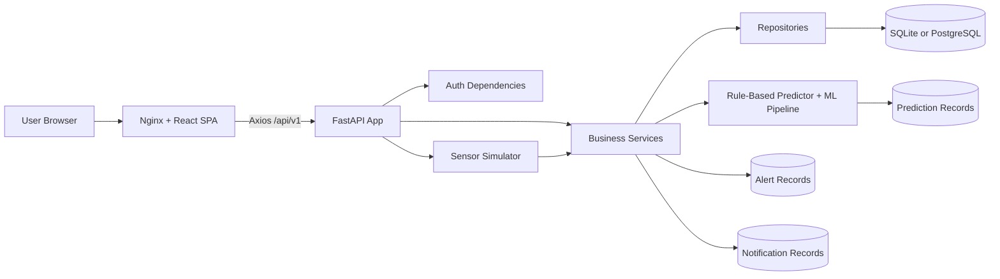
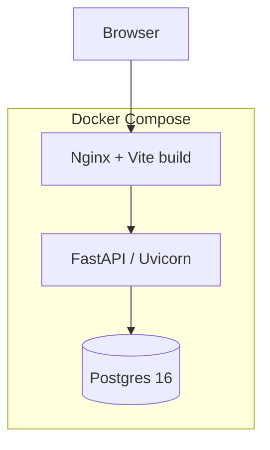
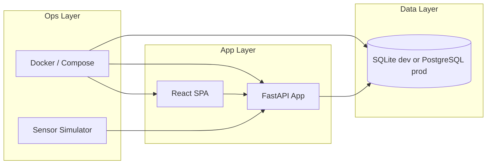
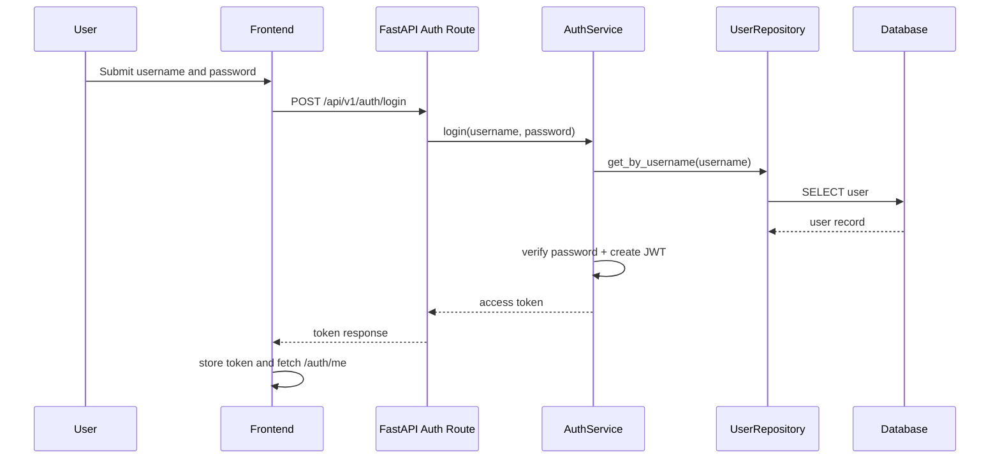
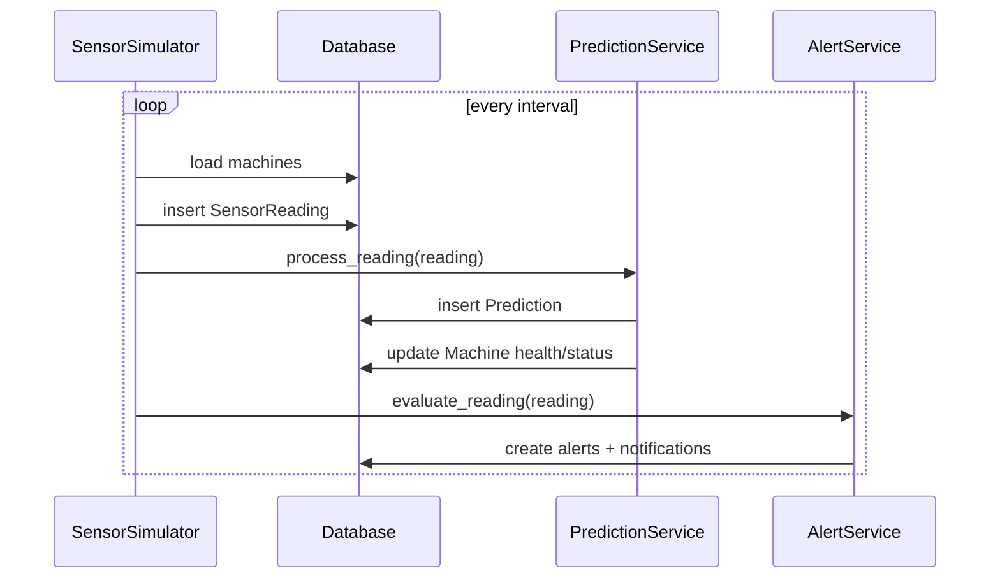
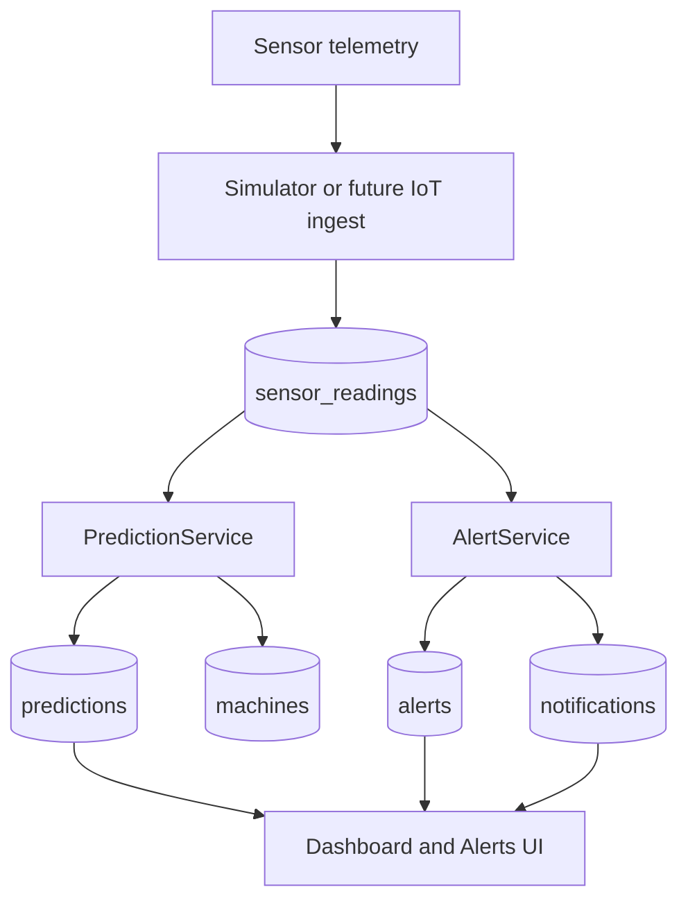
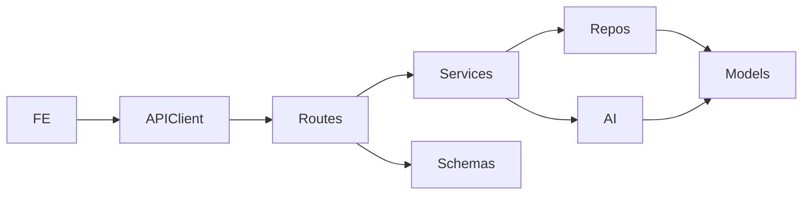
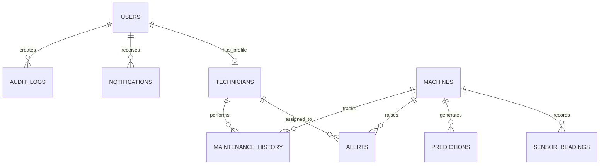
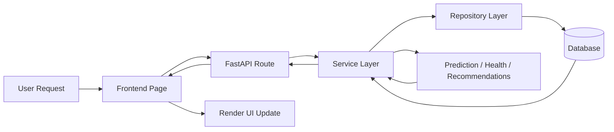

# Ranbridge Industrial Maintenance System

Enterprise Documentation

Version: 1.0
Scope: Full-stack application documentation for the FastAPI backend, React/Vite frontend, database schema, Docker deployment, AI/ML modules, and operational workflows.

## Repository at a Glance

| Area | Key Files | Responsibility |
|---|---|---|
| Backend entrypoint | [backend/app/main.py](../backend/app/main.py), [backend/app/api/routes/__init__.py](../backend/app/api/routes/__init__.py) | FastAPI application lifecycle, middleware, route registration |
| Configuration | [backend/app/core/config.py](../backend/app/core/config.py), [backend/.env.example](../backend/.env.example) | Environment-driven settings and local defaults |
| Security | [backend/app/core/security.py](../backend/app/core/security.py), [backend/app/api/deps.py](../backend/app/api/deps.py) | JWT, password hashing, auth dependencies, role checks |
| Persistence | [backend/app/database/session.py](../backend/app/database/session.py), [backend/app/database/base.py](../backend/app/database/base.py) | SQLAlchemy engine, session factory, ORM base |
| Domain models | [backend/app/models/__init__.py](../backend/app/models/__init__.py) | ORM entities and enums |
| Repositories | [backend/app/repositories/base.py](../backend/app/repositories/base.py) | Data access abstraction and CRUD helpers |
| Services | [backend/app/services/*.py](../backend/app/services) | Business logic, analytics, alerting, prediction, notification, maintenance advice |
| AI/ML | [backend/app/ai/rule_based.py](../backend/app/ai/rule_based.py), [backend/app/ai/ml_pipeline.py](../backend/app/ai/ml_pipeline.py) | Rule-based prediction engine and scikit-learn training pipeline |
| Simulator | [backend/app/simulator/sensor_simulator.py](../backend/app/simulator/sensor_simulator.py) | Background sensor data generation for MVP/demo usage |
| Frontend shell | [frontend/src/App.tsx](../frontend/src/App.tsx), [frontend/src/main.tsx](../frontend/src/main.tsx) | Routing, providers, protected application flow |
| Frontend API client | [frontend/src/services/api.ts](../frontend/src/services/api.ts) | Typed HTTP client, token propagation, 401 handling |
| Frontend state | [frontend/src/contexts/AuthContext.tsx](../frontend/src/contexts/AuthContext.tsx) | Authentication state and session hydration |
| Frontend UI | [frontend/src/components](../frontend/src/components), [frontend/src/pages](../frontend/src/pages) | Reusable widgets and product screens |
| Database schema | [backend/alembic/versions/001_initial_schema.py](../backend/alembic/versions/001_initial_schema.py) | Initial relational schema and indexes |
| Containerization | [docker-compose.yml](../docker-compose.yml), [backend/Dockerfile](../backend/Dockerfile), [frontend/Dockerfile](../frontend/Dockerfile) | Local and production-style deployment |

## Table of Contents

1. Executive Summary
2. Project Vision
3. System Architecture
4. Technology Stack
5. Folder Structure
6. Backend Documentation
7. Frontend Documentation
8. Database Documentation
9. API Documentation
10. Authentication and Security
11. AI / Machine Learning
12. DevOps Documentation
13. Performance Optimization
14. Monitoring and Logging
15. Testing
16. Design Patterns
17. Project Workflow
18. Deployment Guide
19. User Guide
20. Administrator Guide
21. Troubleshooting Guide
22. Coding Standards
23. Future Enhancements
24. Risk Analysis
25. Conclusion
26. Appendices

## 1. Executive Summary

### Project Overview

Ranbridge is a smart industrial maintenance platform for machine health monitoring, predictive maintenance, technician coordination, and alert management. The system combines a FastAPI backend, a React/Vite frontend, a PostgreSQL/SQLite persistence layer, a sensor simulator for development, and a staged AI/ML pipeline.

The codebase is intentionally structured around a layered backend architecture: routes delegate to services, services coordinate repositories, and repositories encapsulate SQLAlchemy ORM access. The frontend consumes the backend through a typed Axios client and protects application routes behind JWT-based authentication.

### Business Problem

Industrial operations lose money through unplanned downtime, delayed maintenance, manual inspection processes, and fragmented communication between operators and technicians. Many factories still rely on reactive maintenance, which increases failure risk and makes it harder to prioritize corrective work.

### Proposed Solution

Ranbridge centralizes machine telemetry, predicts failure risk, creates alerts, recommends maintenance, and surfaces operational dashboards for managers and technicians. It is designed as an MVP that already delivers practical value while leaving a clear path toward model-driven predictive maintenance.

### Objectives

- Monitor machine telemetry and health continuously.
- Detect threshold breaches and probable failures.
- Coordinate technicians and maintenance records.
- Give managers a dashboard for operational insight.
- Provide a secure, role-aware user experience.
- Prepare the platform for future ML-based prediction models.

### Key Features

- Authentication and role-based access control.
- Machine CRUD and search.
- Sensor reading ingestion and trend views.
- Rule-based failure prediction.
- Alert generation and technician assignment.
- Maintenance history tracking.
- Notifications by role and user.
- Dashboard analytics and report generation.
- Sensor simulation for demo and development.

### Business Benefits

- Reduced unplanned downtime.
- Faster fault detection.
- Better maintenance planning.
- Higher technician utilization visibility.
- Improved auditability and accountability.
- Lower operational friction for factory teams.

### Expected Outcomes

- Improved machine health visibility.
- More proactive maintenance decisions.
- Lower time to resolve critical machine events.
- Better communication across operations, maintenance, and management.

### Target Users

- Factory managers
- Maintenance technicians
- System administrators
- QA teams
- Security auditors
- Technical evaluators and demo audiences

## 2. Project Vision

### Mission

Enable industrial teams to detect machine degradation early, prioritize maintenance intelligently, and reduce downtime through a secure, observable, and extensible digital maintenance platform.

### Vision

Evolve the product from an MVP predictive maintenance dashboard into an enterprise industrial intelligence platform that can ingest real IoT streams, host multiple prediction strategies, and integrate with factory operations tooling.

### Goals

- Deliver a production-ready maintenance management core.
- Provide explainable failure assessment.
- Support incremental migration from rules to machine learning.
- Maintain clean domain boundaries for future scaling.
- Preserve operational simplicity for local and containerized deployment.

### Success Metrics

- Reduction in unplanned downtime hours.
- Increase in preventive maintenance completion rate.
- Mean time to acknowledge critical alerts.
- Mean time to assign technicians.
- Percentage of monitored machines with valid health scores.

### KPIs

| KPI | Definition | Why it matters |
|---|---|---|
| Machine health score | Average score across active machines | Indicates overall equipment condition |
| Active alerts | Open alerts by severity | Measures operational risk |
| Predicted failures | Predictions above the threshold | Measures forward-looking risk |
| Available technicians | Technicians available for assignment | Measures response capacity |
| Downtime prevented | Estimated avoided downtime | Supports business value reporting |
| Maintenance cost saved | Estimated cost reduction | Supports ROI analysis |

### Future Roadmap

- Replace the rule-based predictor with validated ML models.
- Add event-driven ingestion for real IoT streams.
- Introduce background job orchestration for scheduled analytics.
- Add granular permissions, audit exports, and approval flows.
- Move from local simulator to a realistic device gateway.

## 3. System Architecture

### Overall Architecture

The system uses a layered monolithic architecture rather than microservices. The backend contains separate route, service, repository, model, and utility layers. The frontend is a single-page application built with React Router and React Query. Docker Compose orchestrates the local deployment of database, backend, and frontend.

### Architecture Style

- Layered backend architecture
- Client-server SPA architecture
- Repository pattern for persistence
- Service orchestration for business logic
- Rule-based AI with a pluggable ML pipeline

### Client-Server Flow

1. The browser loads the React app from the Nginx container.
2. The frontend calls the backend through the Axios client at `/api/v1`.
3. FastAPI resolves authentication and role dependencies.
4. Services interact with repositories and ORM entities.
5. Responses are serialized back to the frontend.

### Microservices Status

The current implementation is not microservices-based. It is a modular monolith with clear seams that could later be extracted into services such as auth, telemetry, alerting, and analytics if scale or organizational boundaries require it.

### Layered Architecture

- Presentation layer: React pages and FastAPI routes
- Application layer: services and orchestration logic
- Domain layer: ORM entities and enums
- Infrastructure layer: SQLAlchemy sessions, JWT, Docker, simulator

### Component Diagram



### Deployment Architecture



### Infrastructure Diagram



### Request Lifecycle

1. User action triggers a React component event.
2. The frontend calls the typed API client.
3. The client attaches the JWT from local storage.
4. FastAPI validates the token and role.
5. Service logic executes and repositories persist data.
6. The response returns as JSON.
7. React Query or component state updates the UI.

### Response Lifecycle

1. FastAPI serializes ORM objects into Pydantic response models.
2. The Axios client resolves the promise or redirects on 401.
3. The UI reflects the updated state or error.

### Sequence Diagram: Login



### Sequence Diagram: Sensor Cycle



### Data Flow Diagram



### Interaction Flow

- Authentication gates the application shell.
- Dashboard pages query analytics endpoints.
- Machine detail views query latest readings and predictions.
- Alerts and maintenance pages support operational workflows.
- Notifications keep users informed without requiring active polling logic beyond standard UI refreshes.

### Dependency Graph



## 4. Technology Stack

### Frontend

| Technology | Why it was selected |
|---|---|
| React 19 | Modern component model, strong ecosystem, clean SPA composition |
| Vite | Fast dev server, small build overhead, simple production bundling |
| TypeScript | Strong typing for API contracts and UI state |
| React Router | Client-side navigation and protected route flows |
| React Query | Server-state caching and async request management |
| Axios | Familiar HTTP client with interceptors and typed responses |
| Recharts | Dashboard and operational chart rendering |
| Lucide React | Consistent iconography with small bundle footprint |
| Tailwind CSS 4 via Vite plugin | Utility-first styling and fast iteration |

### Backend

| Technology | Why it was selected |
|---|---|
| FastAPI | Type-safe API framework with high performance and automatic OpenAPI docs |
| Uvicorn | ASGI server for local and containerized execution |
| SQLAlchemy 2 | Mature ORM, expressive querying, migration-friendly model layer |
| Alembic | Schema migration management |
| Pydantic v2 | Validation, serialization, and response modeling |
| slowapi | Rate limiting for API protection |
| python-jose | JWT encoding and decoding |
| passlib[bcrypt] | Password hashing |
| python-multipart | OAuth form login support |

### Database

| Technology | Why it was selected |
|---|---|
| SQLite | Simple local development and demo storage |
| PostgreSQL | Production-grade relational database in Docker Compose |

### AI/ML

| Technology | Why it was selected |
|---|---|
| NumPy | Vectorized numeric operations for synthetic data and prediction preprocessing |
| pandas | DataFrame manipulation and synthetic training data generation |
| scikit-learn | Standard, explainable baseline models for phase-two ML |
| joblib | Persisting trained models and scalers |

### Cloud and Deployment

| Technology | Why it was selected |
|---|---|
| Docker | Reproducible runtime packaging |
| Docker Compose | Multi-service local orchestration |
| Nginx | Static SPA hosting and reverse proxy to the backend |

### Authentication

| Technology | Why it was selected |
|---|---|
| OAuth2 password flow | Familiar login mechanism for SPA-style applications |
| JWT bearer tokens | Stateless request authentication |
| bcrypt | One-way password hashing |

### State Management

| Technology | Why it was selected |
|---|---|
| React Query | Server cache and background refetching |
| Context API | Global auth state without heavy infrastructure |

### Caching

- Frontend query caching is handled by React Query.
- Backend settings are cached with `functools.lru_cache`.
- No distributed cache is currently implemented.

### Containerization

- Backend container: Python 3.12 slim image with Uvicorn.
- Frontend container: Vite build stage followed by Nginx static serving.

### DevOps

- Docker Compose
- Multi-stage frontend Docker build
- Backend image build with native build dependencies for Python packages
- Environment-variable based configuration

### Monitoring

- Health endpoint `/health`
- Rate limiting through slowapi
- Browser-side 401 handling in Axios interceptor
- Simulator logs to stdout on errors

### Logging

- The current implementation uses minimal explicit logging.
- Audit logs capture selected security-relevant actions in the database.

### Testing

- No dedicated test suite was found in the repository snapshot.

### Package Managers

- Python: pip via `requirements.txt`
- Frontend: npm via `package.json` and `package-lock.json`

### Build Tools

- Alembic migrations
- TypeScript compiler
- Vite
- Oxlint

### Direct Dependencies

Backend direct dependencies are listed in [backend/requirements.txt](../backend/requirements.txt). Frontend direct dependencies are listed in [frontend/package.json](../frontend/package.json).

## 5. Folder Structure

### Top Level

| Path | Purpose |
|---|---|
| [backend](../backend) | FastAPI application, ORM models, services, simulator, migrations |
| [frontend](../frontend) | React/Vite SPA |
| [docker-compose.yml](../docker-compose.yml) | Local multi-service orchestration |
| [docs](../docs) | Enterprise documentation |

### Backend Folder Responsibilities

| Folder | Responsibility | Notes |
|---|---|---|
| [backend/app](../backend/app) | Application package root | Hosts API, core, db, domain, services, simulator |
| [backend/app/api](../backend/app/api) | API layer | Routing and dependency injection |
| [backend/app/api/routes](../backend/app/api/routes) | Versioned endpoint modules | Organized by business domain |
| [backend/app/ai](../backend/app/ai) | Prediction logic | Rule-based engine and ML pipeline |
| [backend/app/core](../backend/app/core) | Settings and security | Environment config, JWT, hashing |
| [backend/app/database](../backend/app/database) | ORM infrastructure | Base and session management |
| [backend/app/models](../backend/app/models) | ORM entities | Users, machines, technicians, alerts, etc. |
| [backend/app/repositories](../backend/app/repositories) | Data access abstraction | CRUD and query specialization |
| [backend/app/schemas](../backend/app/schemas) | Pydantic schemas | Input validation and response contracts |
| [backend/app/services](../backend/app/services) | Business rules | Analytics, alerts, prediction, notifications |
| [backend/app/simulator](../backend/app/simulator) | Background simulation | Synthetic telemetry generation |
| [backend/app/utils](../backend/app/utils) | Utilities | Seed data and startup helpers |
| [backend/alembic](../backend/alembic) | Schema migrations | Database versioning |

### Frontend Folder Responsibilities

| Folder | Responsibility | Notes |
|---|---|---|
| [frontend/src](../frontend/src) | Application source | React app code |
| [frontend/src/components](../frontend/src/components) | Reusable UI elements | Layout, tables, charts, badges |
| [frontend/src/contexts](../frontend/src/contexts) | Shared application state | Authentication |
| [frontend/src/pages](../frontend/src/pages) | Route-driven screens | Dashboard, alerts, machines, maintenance |
| [frontend/src/services](../frontend/src/services) | API integration | Typed Axios client |
| [frontend/src/types](../frontend/src/types) | Shared interfaces | Frontend data contracts |
| [frontend/public](../frontend/public) | Static assets | Served directly by Vite |

### Design Pattern Notes

- Repositories isolate database access from services.
- Services orchestrate workflow and business decisions.
- Routes stay thin and declarative.
- The frontend separates page composition from reusable UI widgets.

## 6. Backend Documentation

### Application Startup

The backend starts in [backend/app/main.py](../backend/app/main.py). The FastAPI lifespan hook creates tables if needed, seeds demo data, and starts the background sensor simulator. On shutdown, the simulator stops gracefully.

### Routing

Routes are registered in [backend/app/api/routes/__init__.py](../backend/app/api/routes/__init__.py) under the `/api/v1` prefix. The route modules are grouped by domain: auth, users, machines, sensor readings, predictions, alerts, technicians, maintenance, analytics, notifications, and AI.

### Controllers

FastAPI route functions act as controllers. They validate input with Pydantic schemas, resolve dependencies, call services or repositories, and return serialized responses.

### Services

| Service | Responsibility |
|---|---|
| [AuthService](../backend/app/services/auth_service.py) | Register users, authenticate logins, update passwords and profile data |
| [AnalyticsService](../backend/app/services/analytics_service.py) | Aggregate dashboard metrics, summaries, and trends |
| [AlertService](../backend/app/services/alert_service.py) | Convert sensor anomalies and high failure probabilities into alerts |
| [PredictionService](../backend/app/services/prediction_service.py) | Run prediction logic, store predictions, update machine health |
| [NotificationService](../backend/app/services/notification_service.py) | Broadcast notifications to users or roles |
| [HealthScoreEngine](../backend/app/services/health_service.py) | Heuristic machine health scoring |
| [RecommendationEngine](../backend/app/services/recommendation_service.py) | Produce maintenance plans and estimates |

### Repositories

Repositories provide a minimal data-access layer around SQLAlchemy sessions. [backend/app/repositories/base.py](../backend/app/repositories/base.py) defines generic CRUD helpers, and specialized repositories expose domain-specific searches such as recent alerts, machine filters, technician lookup, and trend queries.

### Models

The ORM entities in [backend/app/models](../backend/app/models) represent the system of record:

- User
- Machine
- Technician
- SensorReading
- Prediction
- Alert
- Notification
- MaintenanceHistory
- AuditLog

### Schemas and DTOs

[backend/app/schemas/__init__.py](../backend/app/schemas/__init__.py) defines request and response contracts. These schemas enforce field constraints, enum values, and output serialization rules.

### Middleware

The application uses CORS middleware and a rate-limit exception handler. There is no custom middleware stack beyond standard FastAPI and slowapi integration.

### Authentication

JWT authentication is handled via OAuth2 password flow. The token is validated in [backend/app/api/deps.py](../backend/app/api/deps.py), which resolves the current user and enforces role-based access.

### Authorization

- `RequireAdmin` allows only admin users.
- `RequireManager` allows admin and factory manager users.
- `CurrentUser` requires a valid bearer token.

### Business Logic

- `AuthService` prevents duplicate email and username registration.
- `PredictionService` updates machine health and status from predictions.
- `AlertService` generates threshold alerts and failure-probability alerts.
- `AnalyticsService` computes operational KPIs from the stored data.

### Validation

Validation occurs primarily at the schema boundary through Pydantic. Query constraints use FastAPI `Query` limits to protect page sizes and time windows.

### Error Handling

The API raises standard HTTP exceptions for not found, unauthorized, forbidden, and bad request conditions. Frontend Axios interceptors redirect on 401 responses.

### Logging

Audit logs are persisted for selected actions such as login and machine mutation. The simulator prints cycle errors to stdout.

### Configuration

Settings are environment-driven via [backend/app/core/config.py](../backend/app/core/config.py). Important fields include application name, debug flag, secret key, database URL, rate limit, CORS origins, and simulator controls.

### Dependency Injection

FastAPI dependency injection is used for DB sessions, current user resolution, and role enforcement. This keeps route functions concise and testable.

### Utilities

- [seed_sample_data](../backend/app/utils/seed_data.py) provisions demo records.
- [SensorSimulator](../backend/app/simulator/sensor_simulator.py) creates synthetic readings.

### Background Jobs

There is no external scheduler or queue. The background simulator thread acts as the current pseudo-job processor, creating readings and triggering prediction and alert logic at a configured interval.

### Scheduler

No cron-style scheduler exists in the repository. If required, the next step would be APScheduler, Celery, Dramatiq, or an external orchestrator.

## 7. Frontend Documentation

### Application Structure

The frontend is a React SPA bootstrapped in [frontend/src/main.tsx](../frontend/src/main.tsx). [frontend/src/App.tsx](../frontend/src/App.tsx) defines routing, providers, and protected application entry points.

### Pages

| Page | Purpose |
|---|---|
| Dashboard | Executive overview of health, alerts, and maintenance KPIs |
| Machines | Machine list, filtering, and management |
| Machine Detail | Single-machine drill-down view |
| Live Monitoring | Recent sensor telemetry and live operational context |
| Alerts | Alert review and resolution workflows |
| Predictions | Prediction list and machine risk visibility |
| Maintenance | Maintenance history and records |
| Technicians | Technician staffing and assignment management |
| Analytics | Trends, summaries, and reports |
| Digital Twin | Factory twin-style visualization page |
| Profile | User account information |
| Settings | User and application preferences |
| Login | Authentication entry point |
| Not Found | Fallback route |

### Layouts

The app shell is composed through [Layout](../frontend/src/components/Layout.tsx), [Sidebar](../frontend/src/components/Sidebar.tsx), and [Header](../frontend/src/components/Header.tsx). This provides consistent navigation and screen framing.

### Components

| Component | Role |
|---|---|
| DataTable | Structured tabular displays |
| Pagination / PaginationControls | Paging UX for list views |
| StatCard | KPI display blocks |
| StatusBadge | Visual state labeling |
| HealthGauge | Machine health visualization |
| TrendChart | Time-series chart rendering |
| ProtectedRoute | Auth gate for private pages |

### Hooks

The main custom hook surface is the auth hook exposed by [AuthContext](../frontend/src/contexts/AuthContext.tsx). It provides login, logout, authentication state, and hydration of the current user.

### Services

[frontend/src/services/api.ts](../frontend/src/services/api.ts) centralizes every backend call into domain-specific clients for auth, machines, sensor readings, predictions, alerts, technicians, maintenance, notifications, and analytics.

### API Integration

The Axios client automatically:

- injects the JWT bearer token from local storage,
- clears invalid sessions on 401,
- redirects users to the login page when authorization fails.

### State Management

- React Query manages server data caching and refetch behavior.
- Context API stores authentication state.
- Local storage persists token and user session information.

### Routing

React Router defines a public login route and a protected application shell for all operational screens.

### Authentication Flow

1. User submits credentials on the login page.
2. The frontend calls `/api/v1/auth/login` using form-encoded data.
3. The access token is stored in local storage.
4. The frontend fetches `/api/v1/auth/me`.
5. Protected routes become available once user state is hydrated.

### Protected Routes

All operational pages are wrapped by [ProtectedRoute](../frontend/src/components/ProtectedRoute.tsx). Unauthorized users are redirected away from private content.

### Forms and Validation

Form validation is currently handled at API submission time and through schema constraints. The codebase would benefit from additional client-side validation for better UX on critical workflows.

### Styling

The frontend uses Vite with Tailwind CSS 4 support. Component styling is organized around utility classes and shared layout components.

### Responsive Design

The layout is suitable for dashboard and admin usage patterns and can be extended further for mobile-first operational workflows.

### Theme

The current codebase favors a clean operational dashboard style. A future product polish pass could formalize a stronger visual language for factory operations.

## 8. Database Documentation

### ER Diagram



### Database Design

The schema is normalized around core business entities. Machines own telemetry, predictions, alerts, and maintenance history. Users represent identity and access. Technicians can optionally map to users for login-enabled technician profiles.

### Table Documentation

| Table | Purpose | Key columns |
|---|---|---|
| users | Identity and authorization | email, username, hashed_password, role, is_active |
| machines | Asset registry | machine_id, factory, location, status, health_score |
| technicians | Staff and assignment data | user_id, skills, availability, workload |
| sensor_readings | Telemetry history | temperature, vibration, current, humidity, pressure, rpm |
| predictions | Failure assessment output | failure_type, probability, severity, RUL, recommendation |
| alerts | Actionable events | severity, status, technician assignment, thresholds |
| notifications | User inbox | type, status, read flag, reference_id |
| maintenance_history | Completed work records | issue, repair_date, downtime_hours, parts_replaced |
| audit_logs | Security and traceability | action, resource, resource_id, details, ip_address |

### Relationships

- User to Technician: optional one-to-one profile mapping.
- User to Notification: one-to-many.
- User to AuditLog: one-to-many.
- Machine to SensorReading: one-to-many.
- Machine to Prediction: one-to-many.
- Machine to Alert: one-to-many.
- Machine to MaintenanceHistory: one-to-many.
- Technician to Alert: one-to-many optional assignment.
- Technician to MaintenanceHistory: one-to-many optional execution link.

### Indexes

The migration in [backend/alembic/versions/001_initial_schema.py](../backend/alembic/versions/001_initial_schema.py) creates indexes on primary lookup and time-series columns such as user email, username, machine_id, created_at, recorded_at, and foreign-key columns used in dashboards and filtering.

### Constraints

- Unique machine_id for machines.
- Unique email and username for users.
- Foreign keys for referential integrity.
- Enum constraints for status and severity fields.

### Normalization

The schema is approximately in third normal form for the current domain. Repeated telemetry and operational events are stored separately from static entities.

### Data Dictionary

| Column | Type | Meaning |
|---|---|---|
| health_score | float | Current machine health, 0 to 100 |
| failure_probability | float | Probability of failure from the prediction engine |
| downtime_hours | float | Maintenance impact estimate |
| is_auto_assigned | bool | Whether the alert was auto-routed to a technician |
| status | enum/string | Lifecycle state of the record |

### Migration Strategy

- Maintain Alembic migrations for schema changes.
- Keep migrations additive and reversible.
- Avoid relying on `create_all` as the long-term schema management mechanism.

### Backup Strategy

- PostgreSQL volume backup for containerized deployment.
- SQLite file backup for local development.
- Export critical audit and operational tables regularly.

## 9. API Documentation

### API Principles

- All application APIs are mounted under `/api/v1`.
- Most endpoints require a bearer token.
- Page size and time window parameters are bounded.
- Responses are modeled and typed.

### Auth APIs

| Method | URL | Purpose | Auth |
|---|---|---|---|
| POST | /api/v1/auth/register | Register a new user | Public |
| POST | /api/v1/auth/login | Login and obtain JWT | Public |
| GET | /api/v1/auth/me | Get current user | Bearer token |

### User APIs

| Method | URL | Purpose | Auth |
|---|---|---|---|
| GET | /api/v1/users | List users | Admin only |
| GET | /api/v1/users/{user_id} | Get one user | Self or admin |
| PUT | /api/v1/users/{user_id} | Update user profile | Self or admin |

### Machine APIs

| Method | URL | Purpose | Auth |
|---|---|---|---|
| GET | /api/v1/machines | List and filter machines | Authenticated |
| GET | /api/v1/machines/{machine_id} | Get machine details | Authenticated |
| POST | /api/v1/machines | Create machine | Manager or admin |
| PUT | /api/v1/machines/{machine_id} | Update machine | Manager or admin |
| DELETE | /api/v1/machines/{machine_id} | Delete machine | Manager or admin |

### Sensor Reading APIs

| Method | URL | Purpose | Auth |
|---|---|---|---|
| GET | /api/v1/sensor-readings | List recent telemetry | Authenticated |
| GET | /api/v1/sensor-readings/latest/{machine_id} | Get latest readings for a machine | Authenticated |

### Prediction APIs

| Method | URL | Purpose | Auth |
|---|---|---|---|
| GET | /api/v1/predictions | List predictions | Authenticated |
| GET | /api/v1/predictions/latest/{machine_id} | Get latest prediction for a machine | Authenticated |

### Alert APIs

| Method | URL | Purpose | Auth |
|---|---|---|---|
| GET | /api/v1/alerts | List alerts with filters | Authenticated |
| GET | /api/v1/alerts/{alert_id} | Get alert details | Authenticated |
| PUT | /api/v1/alerts/{alert_id} | Update or resolve alert | Authenticated |
| GET | /api/v1/alerts/{alert_id}/assistance | Technician assistance view | Authenticated |

### Technician APIs

| Method | URL | Purpose | Auth |
|---|---|---|---|
| GET | /api/v1/technicians | List technicians | Authenticated |
| GET | /api/v1/technicians/{technician_id} | Get technician | Authenticated |
| POST | /api/v1/technicians | Create technician | Manager or admin |
| PUT | /api/v1/technicians/{technician_id} | Update technician | Manager or admin |
| DELETE | /api/v1/technicians/{technician_id} | Delete technician | Manager or admin |

### Maintenance APIs

| Method | URL | Purpose | Auth |
|---|---|---|---|
| GET | /api/v1/maintenance | List maintenance records | Authenticated |
| GET | /api/v1/maintenance/{record_id} | Get record | Authenticated |
| POST | /api/v1/maintenance | Create record | Authenticated |
| PUT | /api/v1/maintenance/{record_id} | Update record | Authenticated |

### Notifications APIs

| Method | URL | Purpose | Auth |
|---|---|---|---|
| GET | /api/v1/notifications | Get current user notifications | Authenticated |
| PUT | /api/v1/notifications/{notification_id}/read | Mark as read | Authenticated |
| PUT | /api/v1/notifications/{notification_id}/archive | Archive notification | Authenticated |
| PUT | /api/v1/notifications/read-all | Mark all as read | Authenticated |

### Analytics APIs

| Method | URL | Purpose | Auth |
|---|---|---|---|
| GET | /api/v1/analytics/dashboard | Dashboard KPIs | Authenticated |
| GET | /api/v1/analytics/trends/{machine_id} | Machine time-series trends | Authenticated |
| GET | /api/v1/analytics/summary | Executive analytics summary | Authenticated |
| GET | /api/v1/analytics/dashboard/readings | Recent readings for dashboard | Authenticated |
| GET | /api/v1/analytics/dashboard/alerts | Recent alerts for dashboard | Authenticated |
| GET | /api/v1/analytics/dashboard/maintenance | Recent maintenance records for dashboard | Authenticated |
| GET | /api/v1/analytics/reports/{report_type} | Plain text report generation | Authenticated |

### AI APIs

| Method | URL | Purpose | Auth |
|---|---|---|---|
| POST | /api/v1/ai/train | Train an ML model | Admin only |
| GET | /api/v1/ai/models | List supported models | Authenticated |

### Example Request

```http
POST /api/v1/auth/login
Content-Type: application/x-www-form-urlencoded

username=admin&password=admin123
```

### Example Response

```json
{
  "access_token": "<jwt>",
  "token_type": "bearer"
}
```

### Sequence Flow: Dashboard Load

1. Browser authenticates and loads dashboard route.
2. Frontend requests `/analytics/dashboard`.
3. Backend aggregates machine, alert, and technician metrics.
4. Frontend renders KPIs and charts.

## 10. Authentication and Security

### JWT

JWTs are created in [backend/app/core/security.py](../backend/app/core/security.py) and validated in [backend/app/api/deps.py](../backend/app/api/deps.py). The token includes the user identifier and role and expires based on configuration.

### OAuth

The login endpoint uses OAuth2 password flow through FastAPI's `OAuth2PasswordRequestForm`.

### Role-Based Access Control

Role enforcement is implemented with dependency wrappers:

- Admin-only functions for user administration and ML training.
- Manager/admin access for machine and technician CRUD.
- Authenticated access for read-only operational views.

### Permissions

| Role | Typical permissions |
|---|---|
| admin | Full access, user administration, ML training |
| factory_manager | Operational management, machines, technicians, analytics |
| technician | Personal profile, notifications, operational visibility |

### Password Hashing

Passwords are hashed with bcrypt through passlib. Plaintext credentials are never stored.

### Encryption

At rest encryption is not explicitly implemented in application code. In production, database and volume encryption should be enforced by infrastructure.

### HTTPS

The app is HTTP-friendly for local development. Production should terminate TLS at a reverse proxy, ingress, or load balancer.

### Secrets Management

Sensitive values are environment variables. The repository includes default development values in `.env.example` and `docker-compose.yml`, but production secrets must be injected securely.

### Environment Variables

| Variable | Purpose |
|---|---|
| APP_NAME | Application display name |
| APP_ENV | Environment label |
| DEBUG | Debug toggle |
| SECRET_KEY | JWT signing secret |
| ALGORITHM | JWT algorithm |
| ACCESS_TOKEN_EXPIRE_MINUTES | Token lifetime |
| DATABASE_URL | Database connection string |
| CORS_ORIGINS | Allowed browser origins |
| RATE_LIMIT | API request rate limit |
| SIMULATOR_INTERVAL_SECONDS | Simulator cadence |
| SIMULATOR_ENABLED | Turn simulator on or off |

### CORS

Allowed origins are parsed from `CORS_ORIGINS` and installed via FastAPI CORS middleware.

### CSRF

The current JWT-in-header approach reduces classical CSRF exposure for API calls, but browser storage of the token makes XSS protection important.

### XSS

The frontend stores tokens in local storage, so XSS prevention is a priority. Content security policy, input sanitization, and safe rendering practices should be strengthened in production.

### SQL Injection Protection

SQLAlchemy ORM and parameterized queries protect the application from raw SQL injection in normal code paths.

### Rate Limiting

slowapi limits traffic using the configured rate limit and applies the same protection to the `/health` endpoint.

### Audit Logs

[backend/app/models/audit_log.py](../backend/app/models/audit_log.py) records login and machine mutation events. This provides basic traceability for administrative operations.

### OWASP Compliance

The system aligns with several OWASP expectations, but production hardening should still add security headers, secure cookie strategy if tokens move out of local storage, CSP, centralized secrets management, and stronger audit coverage.

## 11. AI / Machine Learning

### Problem Statement

Predict machine failures early enough to reduce downtime and coordinate maintenance before costly breakdowns occur.

### Dataset

The current ML pipeline uses synthetic training data generated from normal distributions and rule-based labels. It is a bootstrap dataset, not a validated production telemetry corpus.

### Data Cleaning

The current pipeline does not include an explicit production cleaning stage. For synthetic data, the generator creates controlled numeric ranges and labels failure cases using threshold logic.

### Feature Engineering

The ML pipeline uses six features:

- temperature
- vibration
- current
- humidity
- pressure
- rpm

### Training Pipeline

[backend/app/ai/ml_pipeline.py](../backend/app/ai/ml_pipeline.py) generates synthetic data, splits it into train and test sets, standardizes features, trains one of three classifiers, evaluates accuracy, and persists the model and scaler.

### Models

- RandomForestClassifier
- GradientBoostingClassifier
- LogisticRegression

### Algorithmic Mathematics

#### 1. Health Score Heuristic

The health engine computes penalties per sensor dimension and subtracts them from 100.

$$
\text{score} = \mathrm{clip}\left(100 - p_T - p_V - p_I - p_P - p_H - p_R - p_D,\ 0,\ 100\right)
$$

Where the penalties are defined by piecewise linear functions:

$$
p_T = \max\left(0, \frac{T - 70}{20}\right) \cdot 25
$$

$$
p_V = \max\left(0, \frac{V - 3}{4}\right) \cdot 25
$$

$$
p_I = \max\left(0, \frac{I - 12}{8}\right) \cdot 20
$$

$$
p_P = \max\left(0, \frac{P - 100}{40}\right) \cdot 10
$$

$$
p_H = \max\left(0, \frac{H - 55}{30}\right) \cdot 8
$$

$$
p_R = \max\left(0, \left|\frac{RPM - 2400}{2400}\right|\right) \cdot 8
$$

$$
p_D = \left(\min\left(0.25, \frac{n}{100}\right)\right) \cdot 20
$$

Where $n$ is history_count.

#### 2. Alert Threshold Logic

An alert is generated when a reading crosses a warning or critical boundary. The system uses deterministic threshold comparisons:

$$
x > \tau_{critical} \Rightarrow \text{critical alert}
$$

$$
x > \tau_{warning} \Rightarrow \text{medium alert}
$$

The current thresholds are defined in [backend/app/ai/rule_based.py](../backend/app/ai/rule_based.py).

#### 3. Rule-Based Failure Probability

The rule engine maps condition patterns to discrete failure probabilities. Example outcomes include 0.92 for bearing failure and 0.88 for motor overheating.

The model is heuristic rather than probabilistic in the statistical sense. It encodes expert knowledge through if-else rules.

#### 4. Remaining Useful Life Estimate

The remaining useful life is estimated as:

$$
RUL = H_s \cdot \max(0.1, 1 - p)
$$

Where $H_s$ is the severity-dependent base horizon and $p$ is failure probability.

#### 5. Logistic Regression

For a binary outcome, logistic regression estimates:

$$
P(y = 1 | x) = \sigma(w^Tx + b)
$$

where

$$
\sigma(z) = \frac{1}{1 + e^{-z}}
$$

#### 6. Random Forest

Random forest predicts by aggregating $B$ decision trees:

$$
\hat{y} = \mathrm{mode}(T_1(x), T_2(x), \dots, T_B(x))
$$

#### 7. Gradient Boosting

Gradient boosting builds an additive model:

$$
F_M(x) = \sum_{m=1}^{M} \gamma_m h_m(x)
$$

where each weak learner fits the residual direction of the previous ensemble.

### Inference

The current production path uses `rule_based` prediction. The ML pipeline is present, trainable, and persistable, but not yet wired into the request lifecycle.

### Deployment

Trained models are saved under `backend/app/ai/models/`. That directory is the local artifact store for joblib model and scaler files.

### Retraining Strategy

- Re-train on collected historical telemetry.
- Validate against known failure events.
- Track model version and metrics.
- Promote only when accuracy and recall satisfy release criteria.

### Model Versioning

Model and scaler filenames are keyed by model name. In production, semantic versioning and metadata should be added to avoid ambiguity.

### Monitoring

- Accuracy and classification reports from the training pipeline.
- Failure-rate drift in production telemetry.
- Prediction-distribution changes over time.

## 12. DevOps Documentation

### Docker

[backend/Dockerfile](../backend/Dockerfile) builds a Python 3.12 image and starts Uvicorn. [frontend/Dockerfile](../frontend/Dockerfile) performs a two-stage React build and serves the output with Nginx.

### Docker Compose

[docker-compose.yml](../docker-compose.yml) defines three services:

- `db`: PostgreSQL 16
- `backend`: FastAPI application
- `frontend`: Nginx-served React bundle

### CI/CD

No CI/CD workflow files were found in the repository snapshot. That means the current project has no visible automated pipeline for build, lint, test, or deployment.

### GitHub Actions

Not present. Recommended additions:

- backend lint and type validation
- frontend lint and build validation
- migration sanity checks
- container image build and push

### Build Pipeline

1. Install backend dependencies from `requirements.txt`.
2. Build the backend container.
3. Install frontend dependencies from `package-lock.json`.
4. Build the frontend bundle with Vite.
5. Copy the bundle into the Nginx runtime image.

### Release Pipeline

Recommended release flow:

1. Merge to main.
2. Run lint, tests, and build validation.
3. Build versioned images.
4. Run migrations.
5. Deploy backend and frontend.
6. Validate `/health` and dashboard pages.

### Environment Management

- Development defaults are defined in `.env.example`.
- Docker Compose overrides runtime values for container networking.
- Production secrets should be injected externally.

### Versioning

- Backend API is versioned under `/api/v1`.
- Database is versioned via Alembic migrations.
- Frontend dependencies are pinned via `package-lock.json`.

### Deployment Strategy

The current deployment strategy is container-based. For larger environments, the app could be deployed behind a reverse proxy or ingress controller with managed PostgreSQL.

### Rollback

- Roll back by redeploying the previous image tag.
- Keep Alembic downgrades for reversible schema changes when practical.
- Preserve database backups before major schema transitions.

### Infrastructure

- PostgreSQL for relational data
- Nginx for SPA hosting
- FastAPI/Uvicorn for API serving
- Optional simulator thread for demo data

## 13. Performance Optimization

### Caching

- React Query caches server responses on the frontend.
- Application settings are cached on the backend.

### Lazy Loading

No explicit route-level lazy loading is implemented in the frontend. This is a reasonable optimization opportunity for large enterprise usage.

### Pagination

List endpoints use page and page_size with server-side pagination to keep responses bounded.

### Compression

Nginx can provide response compression in production, but the current config does not explicitly enable it.

### Database Optimization

- Indexes exist on frequently queried fields.
- Timestamp columns are indexed for trend and recent-data queries.
- Foreign keys support efficient relational joins.

### Query Optimization

Repositories centralize filter logic, keeping query paths predictable. The current dashboard queries are simple aggregation queries over modest data volumes.

### Asynchronous Processing

The simulator runs in a background thread. Other heavy tasks remain synchronous and would benefit from async job execution if load increases.

### Threading

The simulator uses a daemon thread for periodic sensor generation.

### Connection Pooling

SQLAlchemy uses `pool_pre_ping=True`. That improves resilience to stale connections, especially with PostgreSQL.

### Benchmark Results

No benchmark data was found in the repository. Performance claims should be validated with load tests before production rollout.

## 14. Monitoring and Logging

### Logging Strategy

The current logging strategy is minimal and mostly operational. Audit events are persisted to the database, and simulator failures are printed to stdout.

### Monitoring

- `/health` endpoint for liveness checks
- Dashboard KPIs for application-level monitoring
- Database-backed analytics for business monitoring

### Health Checks

The health endpoint reports app status and whether the simulator is active.

### Metrics

Dashboard and analytics responses expose metrics such as health scores, active alerts, predicted failures, downtime prevented, and maintenance cost saved.

### Alerts

Database alerts represent domain incidents. They are separate from infrastructure alerts and should be supplemented by platform monitoring in production.

### Crash Reporting

No external crash reporting service is configured.

### Tracing

No distributed tracing stack is implemented.

### Observability

The system has the foundation for observability through business metrics, audit logs, and health endpoints, but it does not yet include centralized logs, traces, or metrics export.

## 15. Testing

### Unit Tests

No unit test files were found in the repository snapshot.

### Integration Tests

No integration test suite was found.

### API Tests

No dedicated API tests were found.

### Load Tests

No load testing harness was found.

### Stress Tests

No stress testing harness was found.

### Performance Tests

No performance test artifacts were found.

### Security Tests

No automated security test suite was found.

### Test Coverage

Current test coverage is effectively unknown from the repository snapshot.

### Mocking Strategy

There is no visible mocking strategy yet. Recommended approach:

- Mock repositories in service tests.
- Mock the Axios client in frontend tests.
- Use sample ORM fixtures for route-level tests.

## 16. Design Patterns

| Pattern | Where it appears | Why it is used |
|---|---|---|
| Repository | repository classes | Isolates persistence logic |
| Service layer | service classes | Encapsulates business rules |
| Dependency Injection | FastAPI dependencies | Supplies DB session, user, and role context |
| Factory | `get_predictor` | Enables future predictor substitution |
| Singleton-like instance | `simulator` object | Provides one background simulator per app process |
| Strategy-like branching | auth/authorization and prediction selection | Supports role and algorithm variations |
| Decorator | FastAPI route decorators | Declares HTTP semantics concisely |
| Layered architecture | backend package structure | Improves maintainability and separation of concerns |

### Why They Were Used

These patterns reduce coupling, keep request handlers small, make domain logic testable, and leave room for future ML and infrastructure evolution.

## 17. Project Workflow

### Complete Lifecycle



### Narrative Workflow

1. The user opens the SPA and logs in.
2. The frontend stores the token and hydrates profile state.
3. Operational pages query backend endpoints.
4. Telemetry creates predictions and alerts.
5. Managers and technicians respond to issues.
6. Maintenance records close the loop and improve future analytics.

## 18. Deployment Guide

### Requirements

- Docker and Docker Compose
- Python 3.12 for local backend development
- Node.js 20+ for frontend development
- PostgreSQL for containerized deployment

### Installation

1. Clone the repository.
2. Configure environment variables.
3. Install backend and frontend dependencies.
4. Start the services with Docker Compose or run them separately.

### Environment Variables

Use [backend/.env.example](../backend/.env.example) as the baseline. Replace the development secret key and database URL for production.

### Database Setup

- Local development defaults to SQLite.
- Docker Compose uses PostgreSQL.
- Alembic should be used for schema evolution.

### Running Locally

- Backend: run Uvicorn against `app.main:app`.
- Frontend: run Vite dev server.

### Docker Deployment

Use `docker compose up --build` from the repository root. The frontend is available through Nginx, the backend on port 8000, and PostgreSQL on port 5432.

### Production Deployment

- Set a strong JWT secret.
- Use PostgreSQL, not SQLite.
- Disable the simulator unless demo data is required.
- Put TLS termination in front of the frontend and backend.

### Cloud Deployment

The architecture maps cleanly to cloud services:

- Container registry for images
- Managed PostgreSQL
- Load balancer or ingress
- Object storage for exported reports and future artifacts

### Scaling

- Scale frontend statically through CDN or edge cache.
- Scale backend horizontally behind a load balancer.
- Move simulator and heavy analytics into background workers.

## 19. User Guide

### Login

Users authenticate with a username and password. After login, the dashboard and operational screens become available.

### Dashboard

The dashboard shows machine health, active alerts, technician capacity, and maintenance impact metrics.

### Machines

Users can list machines, inspect individual assets, and track machine health over time.

### Alerts

Users can review, acknowledge, resolve, and inspect assistance details for alerts.

### Predictions

Users can inspect the latest failure prediction per machine and understand risk context.

### Maintenance

Users can record and review completed maintenance work.

### Notifications

Users can read, archive, and bulk-mark notifications as read.

### Screenshot Placeholders

- Dashboard screenshot placeholder
- Machine detail screenshot placeholder
- Alert workflow screenshot placeholder
- Maintenance record screenshot placeholder

## 20. Administrator Guide

### Admin Dashboard

The admin can manage users, machines, technicians, and model training operations. The system already exposes the necessary APIs for these administrative duties.

### Configuration

Administrators should manage environment variables for tokens, CORS, rate limits, simulator behavior, and database connectivity.

### Maintenance

- Review audit logs.
- Validate health endpoint status.
- Check that the simulator is running only when intended.

### Backups

- Back up the relational database regularly.
- Verify restore procedures.

### Logs

Database audit logs currently capture important security events. Platform logs should be centralized in production.

### User Management

Administrators can list and update users and assign roles.

## 21. Troubleshooting Guide

### Common Issues

| Issue | Likely cause | Solution |
|---|---|---|
| Login fails | Wrong credentials or inactive account | Verify user status and password |
| 401 after login | Token expired or invalid | Reauthenticate and refresh session |
| CORS errors | Frontend origin not allowed | Add the origin to `CORS_ORIGINS` |
| No data on dashboard | Empty database or simulator disabled | Seed data and enable simulator |
| Database connection errors | Wrong `DATABASE_URL` | Correct the connection string |
| Container startup failures | Missing dependencies or bad config | Rebuild the images and inspect logs |

### Error Codes

- 400: invalid request or duplicate resource
- 401: authentication failure
- 403: authorization failure
- 404: resource not found
- 204: successful delete with no content

### Debugging Steps

1. Check `/health`.
2. Inspect browser network calls.
3. Verify the JWT is present in local storage.
4. Confirm the database contains seeded records.
5. Review simulator and container logs.

## 22. Coding Standards

### Naming Conventions

- Python modules use snake_case.
- React components use PascalCase.
- Database tables follow plural nouns.
- API paths are lowercase and hyphenated where relevant.

### Folder Standards

- Keep route, service, repository, and model layers separated.
- Keep frontend components reusable and page files focused.

### Code Formatting

- Python: conventional formatting with type hints.
- TypeScript: strict compiler settings and linting.

### Documentation Standards

- Keep schemas, routes, and models documented together.
- Update migration notes whenever the schema changes.

### Git Workflow

- Feature branches for functional changes.
- Pull requests for review and validation.

### Branch Strategy

Recommended strategy:

- main for stable releases
- develop for integration
- feature/* for work items

### Commit Convention

Recommended format:

- feat: new capability
- fix: bug fix
- docs: documentation change
- refactor: code restructuring
- chore: tooling or maintenance

## 23. Future Enhancements

### Scalability Improvements

- Externalize simulator and prediction work into background jobs.
- Add caching for frequent analytics queries.
- Partition telemetry tables if data volume grows substantially.

### AI Improvements

- Replace synthetic training data with real telemetry.
- Add calibrated probability outputs.
- Add explainability metadata and drift tracking.

### Security Improvements

- Add security headers and CSP.
- Move tokens away from local storage if practical.
- Add more granular audit logging.

### Cloud Migration

- Move to managed PostgreSQL.
- Add CDN for static assets.
- Introduce secrets manager integration.

### Microservices

- Split auth, telemetry, analytics, and notifications if organizational scale requires it.

### Kubernetes

- Convert Compose to manifests or Helm charts.
- Add liveness and readiness probes.

### Event-Driven Architecture

- Publish telemetry and alert events to a message bus.
- Decouple prediction from synchronous request paths.

### Serverless

- Candidate functions: report generation, notification fan-out, scheduled analytics jobs.

## 24. Risk Analysis

### Technical Risks

- `create_all` at startup can hide migration discipline issues.
- Simulator and prediction logic currently run in-process.
- No visible test suite increases regression risk.

### Security Risks

- JWT in local storage is vulnerable to XSS if frontend defenses weaken.
- Default development secrets must never reach production.
- Audit coverage is partial.

### Operational Risks

- Background simulator may create noise if left enabled in production.
- Heavy analytics requests could grow expensive without caching.

### Business Risks

- Synthetic training data could create false confidence in ML readiness.
- Without real device integrations, some workflows remain demo-oriented.

### Mitigation Strategies

- Add tests and CI gates.
- Move to migration-first startup.
- Harden frontend security.
- Separate demo simulation from production ingestion.
- Replace synthetic ML data with verified datasets.

## 25. Conclusion

### Achievements

The project delivers a coherent industrial maintenance platform with secure authentication, asset management, telemetry, alerts, analytics, and an extensible AI foundation.

### Business Value

Ranbridge directly supports proactive maintenance, better coordination, and measurable downtime reduction.

### Technical Strengths

- Clean layered backend structure
- Strong API contract modeling
- Role-aware access control
- Reproducible container deployment
- Clear path from rules to ML

### Lessons Learned

- The architecture is ready for growth, but operational maturity still depends on tests, CI/CD, and observability.
- Synthetic ML should be treated as an implementation bridge, not a final production substitute.

## 26. Appendices

### Glossary

| Term | Meaning |
|---|---|
| RUL | Remaining useful life |
| SPA | Single-page application |
| KPI | Key performance indicator |
| RBAC | Role-based access control |
| ORM | Object-relational mapping |
| MVP | Minimum viable product |

### Acronyms

- API: Application programming interface
- JWT: JSON Web Token
- ML: Machine learning
- DDD: Domain-driven design
- OWASP: Open Worldwide Application Security Project

### References

- [backend/app/main.py](../backend/app/main.py)
- [backend/app/api/routes](../backend/app/api/routes)
- [backend/app/models](../backend/app/models)
- [backend/app/services](../backend/app/services)
- [backend/app/ai/rule_based.py](../backend/app/ai/rule_based.py)
- [backend/app/ai/ml_pipeline.py](../backend/app/ai/ml_pipeline.py)
- [frontend/src/App.tsx](../frontend/src/App.tsx)
- [frontend/src/services/api.ts](../frontend/src/services/api.ts)
- [docker-compose.yml](../docker-compose.yml)

### Architecture Decisions

#### ADR-001: Modular Monolith

Use a modular monolith with clear boundaries instead of microservices at MVP stage to minimize operational complexity.

#### ADR-002: Rule-Based Prediction First

Use deterministic rules first so that the system provides explainable outputs immediately and supports future model replacement.

#### ADR-003: Repository and Service Layers

Use a service/repository split to keep domain logic testable and persistence concerns isolated.

#### ADR-004: JWT Bearer Authentication

Use stateless JWT authentication for straightforward SPA integration.

### License

No repository license file was found in the snapshot. Add one before public release.

### Contributors

Not specified in the repository snapshot.

### Version History

| Version | Date | Notes |
|---|---|---|
| 1.0 | 2026-08-04 | Initial enterprise documentation generated from repository analysis |

### Production Readiness Summary

The codebase is functionally coherent and well-layered, but production readiness still depends on adding automated tests, CI/CD, hardened secrets management, stronger observability, and a migration-first operational model.